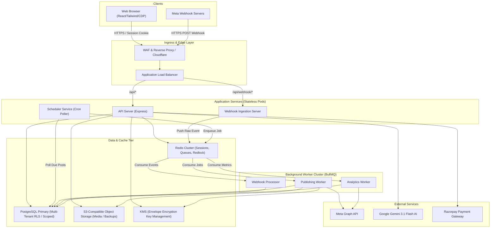
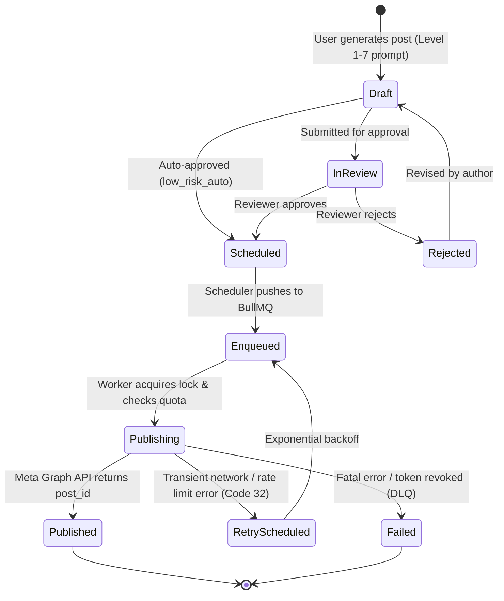
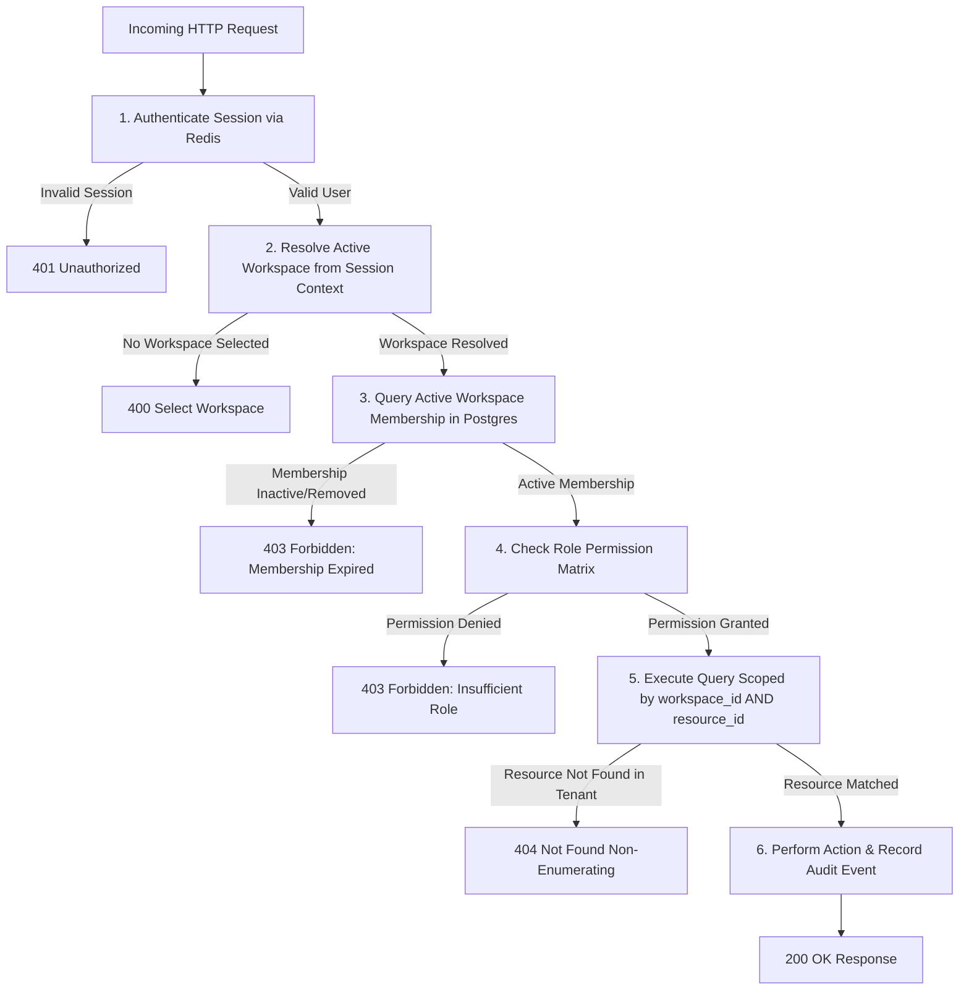

# Target Multi-Tenant SaaS Architecture

## 1. Architectural Principles

1. **Tenant Isolation as Primary Security Boundary:** Every database query, cache key, background job, file asset, and external API invocation must be strictly partitioned by `workspace_id`.
2. **Decoupled Asynchronous Processing:** Long-running, external network-dependent, or scheduled tasks must never run within synchronous HTTP request loops.
3. **Defense-in-Depth Authorization:** Identity authentication (Who are you?) is strictly separated from Workspace Membership and Resource Ownership (What tenant and resource are you authorized to touch?).
4. **Idempotency by Design:** All publishing events, webhooks, billing notifications, and migrations must execute idempotently without side-effects on replay.
5. **Zero Secret Exposure:** Raw external tokens (Meta user/page tokens, Gemini keys, Stripe/Razorpay secrets) are never exposed via APIs or logged in plaintext.

---

## 2. High-Level System Architecture

---

## 3. Component Decomposition & Responsibilities

### 3.1. API Server (Express)
- **Role:** Synchronous request-response gateway for user authentication, workspace administration, Page DNA configuration, post authoring, and billing.
- **Responsibilities:**
  - Authenticates sessions against Redis opaque hashes.
  - Resolves active workspace membership and enforces RBAC permissions.
  - Executes tenant-scoped CRUD queries against PostgreSQL.
  - Performs Gemini AI generation for post drafting.
  - Uploads media assets to S3 and returns signed presigned URLs.
  - Emits tenant-scoped Server-Sent Events (SSE) for UI reactivity.

### 3.2. Webhook Ingestion Server
- **Role:** High-throughput, stateless receiver for Meta and Razorpay webhook events.
- **Responsibilities:**
  - Validates cryptographic signatures (`X-Hub-Signature-256` for Meta, `X-Razorpay-Signature` for billing).
  - Immediately responds with HTTP `200 OK` (within < 150ms).
  - Enqueues verified raw payloads into Redis BullMQ for asynchronous tenant resolution and processing.

### 3.3. Scheduler Service
- **Role:** Cron dispatcher evaluating upcoming post schedules across all workspaces.
- **Responsibilities:**
  - Queries PostgreSQL every 30 seconds for scheduled posts where `scheduled_at <= NOW()` and `status = 'pending'`.
  - Dispatches discrete publishing jobs into the `publishing-queue` in BullMQ.
  - Enforces per-tenant rate caps (`maxPostsPerDay`, `minimumPostGapMinutes`).

### 3.4. Background Worker Cluster (BullMQ)
- **Publishing Worker:**
  - Acquires distributed lock on `(workspace_id, facebook_page_id)` via Redlock to serialize page posts.
  - Checks workspace subscription status and quota entitlements in PostgreSQL.
  - Decrypts envelope-encrypted Page Access Token via KMS.
  - Downloads media from S3 and posts to Meta Graph API.
  - Records `publish_attempts` and transitions post status to `published` or `failed`.
- **Analytics Worker:**
  - Periodically polls Meta Graph API for post impressions, reactions, and reach metrics.
  - Aggregates daily usage counters per workspace.
- **Webhook Processor:**
  - Consumes queued webhook payloads.
  - Resolves target `workspace_id` by looking up the Meta `entry.id` (Page ID) in `facebook_pages`.
  - Dispatches notifications or updates post delivery statuses.

---

## 4. State & Lifecycle Flows

### 4.1. Post Publishing Flow (Draft to Published)

### 4.2. Synchronous Tenant Request Authorization Flow

---

## 5. Network & Egress Topology

### Production Topology (AWS ap-south-1 Mumbai)
1. **Public Subnet:**
   - Application Load Balancers (ALB).
   - NAT Gateways with static Elastic IP addresses (whitelisted with Meta App security configurations).
2. **Private Application Subnet:**
   - API Server pods (auto-scaling 2–10 instances).
   - Background Worker pods.
   - Scheduler pod (active/standby).
3. **Private Isolated Data Subnet:**
   - PostgreSQL Multi-AZ cluster (Primary + Standby replica).
   - Redis Cluster (3 shards, primary + replica).
   - Zero public internet ingress or egress to database subnet.
4. **Egress Boundary:**
   - All outgoing requests to Meta (`graph.facebook.com`) and Gemini (`generativelanguage.googleapis.com`) route through NAT Gateways.
   - Dedicated circuit breaker and rate limiter per Meta App ID to prevent noisy-neighbor throttling.

### Development & Test Topology
- Enforces strict network guard: all external network traffic is intercepted and restricted to `127.0.0.1` / `localhost`.
- Zero live Meta Graph API or Gemini calls permitted during test runs.

---

## 6. Current vs. Target vs. Deferred Matrix

| Architectural Dimension | Current Codebase | Target SaaS Architecture | Deferred / Post-MVP |
| :--- | :--- | :--- | :--- |
| **Tenancy Model** | Single-tenant (operator) | Multi-tenant with shared DB + `workspace_id` row scoping | Dedicated DB / Schema per tenant |
| **Session Storage** | In-memory `Map` (max 500) | Distributed Redis cluster, SHA-256 opaque tokens | Edge-authenticated session cookies |
| **Database** | Flat JSON files (`settings.json`) | PostgreSQL with foreign keys and strict constraints | Distributed CockroachDB / Spanner |
| **Scheduling** | In-process `node-cron` & `setInterval` | Decoupled BullMQ workers + Redis Redlock | Temporal / AWS Step Functions |
| **Secret Storage** | Plaintext JSON on disk | Envelope encryption (AES-256-GCM + KMS) | HashiCorp Vault / Cloud HSM |
| **File Storage** | Local `/uploads` directory | S3 / Cloudflare R2 presigned URLs | Multi-region CDN edge caching |
| **OAuth Integration** | Manual access token paste | Automated Meta OAuth 2.0 PKCE connection | Custom agency OAuth apps |
| **Observability** | Console stdout logging | Structured JSON + OpenTelemetry + Datadog/Grafana | Distributed trace sampling |
