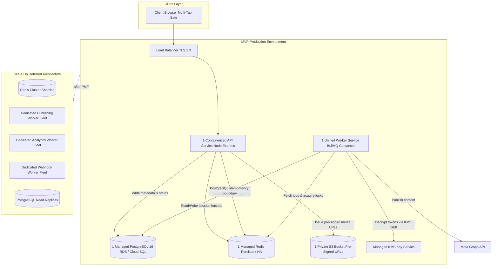
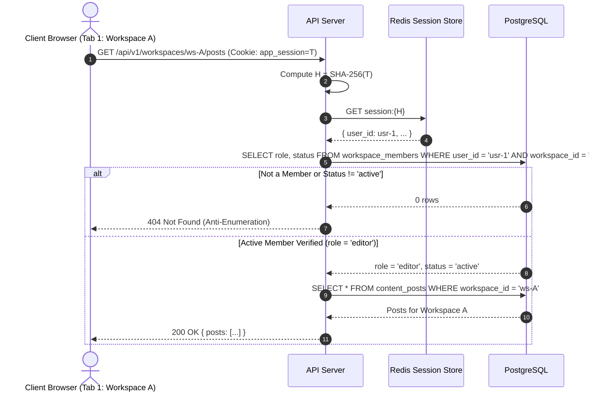

# Multi-Tenant SaaS Target Architecture

## 1. System Overview

The target SaaS transforms the single-operator automation tool into a multi-tenant, cloud-native content operating system designed specifically for Bengali-speaking businesses, coaching centres, restaurants, boutiques, and digital marketing agencies.

```
+-----------------------------------------------------------------------------+
|                             System Topology                                 |
+--------------------------+--------------------------------------------------+
| CURRENT (Single-Tenant)  | Flat JSON files in data/, volatile in-memory     |
|                          | sessions in middleware/auth.js, node-cron and    |
|                          | setInterval in services/scheduler.js             |
+--------------------------+--------------------------------------------------+
| TARGET (Multi-Tenant)    | PostgreSQL 16 (Relational/ACID), Redis HA        |
|                          | (Sessions & Queues), BullMQ worker service,      |
|                          | S3 object storage, multi-tab request context     |
+--------------------------+--------------------------------------------------+
| DEFERRED                 | Dedicated worker fleets per domain, Redis        |
|                          | Cluster sharding, multi-region database replicas |
+--------------------------+--------------------------------------------------+
```

---

## 2. Infrastructure Architecture: MVP vs Scale-Up

To avoid premature operational overhead, infrastructure is strictly right-sized:



---

## 3. Core Component Decomposition

### 1. Web & API Service (`api`)
- Stateless Express application behind an HSTS/TLS 1.3 load balancer.
- Authenticates users via Redis opaque sessions (SHA-256 token hashing).
- Resolves workspace context per-request (via URL `/api/v1/workspaces/:wsId/...` or `X-Workspace-Id` header).
- Validates active membership in `workspace_members` and enforces canonical RBAC roles (`owner`, `admin`, `editor`, `reviewer`, `viewer`).
- Enforces server-side plan entitlements before generating drafts or adding pages.

### 2. Scheduler Producer
- Integrated within the worker service (or leader-elected instance).
- Polls PostgreSQL `scheduled_posts` table for items due within the upcoming 60-second window.
- Dispatches jobs to Redis BullMQ with strict job payloads (`workspaceId`, `facebookPageId`, `scheduledPostId`, `idempotencyKey`).

### 3. Unified Worker Service (`worker`)
- Single containerized process running BullMQ consumers for:
  - **Publishing Queue**: Manages token decryption, S3 asset retrieval, PostgreSQL idempotency, Graph API rate-limit throttling, and post publication.
  - **Analytics Queue**: Asynchronously gathers reactions, shares, and comments.
  - **Webhook Queue**: Processes asynchronous Meta webhooks (feed updates, permission drops) and Razorpay billing webhooks.

### 4. Storage & Secret Services
- **PostgreSQL 16**: System of record for all entities. Enforces composite foreign keys `(workspace_id, parent_id)` to guarantee tenant isolation at the database layer.
- **Redis**: Fast volatile store for opaque session hashes, OAuth state hashes, BullMQ queues, and Redlock distributed locks.
- **S3 Object Storage**: Private storage for uploaded media assets. Access is restricted to 15-minute pre-signed URLs.
- **Cloud KMS**: Hardware-backed Key Management Service managing master Key Encryption Keys (KEK).

---

## 4. Multi-Tab-Safe Request Lifecycle



### Multi-Tab Safety Guarantee
Because workspace authorization is evaluated strictly from the request path (`/api/v1/workspaces/:wsId/...`) or `X-Workspace-Id` header against the database on every request—and never stored as a mutable global field on the user session—users can manage multiple workspaces across separate browser tabs simultaneously without context interference.
