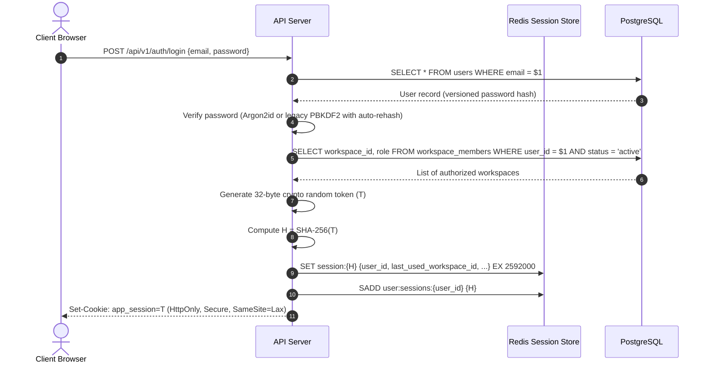
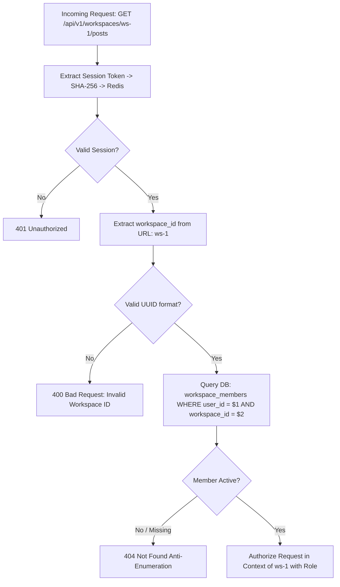
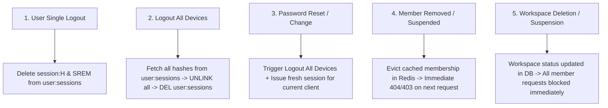

# SaaS Authentication and Session Architecture

## 1. Executive Summary

This document specifies the target authentication architecture, session management system, password hashing evolution, and multi-tab workspace context handling for the multi-tenant Bengali-first Facebook Auto-Poster SaaS.

```
+-----------------------------------------------------------------------------+
|                            Authentication Status                            |
+--------------------------+--------------------------------------------------+
| CURRENT (Single-Tenant)  | In-memory Map in middleware/auth.js,             |
|                          | PBKDF2-HMAC-SHA512 (100k iterations), single-    |
|                          | user operator model, volatile across restarts    |
+--------------------------+--------------------------------------------------+
| TARGET (Multi-Tenant)    | Redis-backed opaque bearer sessions,             |
|                          | SHA-256 token hashing, multi-tab request-scoped  |
|                          | workspace context, Argon2id with login rehash,   |
|                          | multi-device revocation cascades                 |
+--------------------------+--------------------------------------------------+
| DEFERRED                 | SAML 2.0 / Enterprise SSO, FIDO2 / WebAuthn,     |
|                          | Social login (Sign-in with Google)               |
+--------------------------+--------------------------------------------------+
```

---

## 2. Password Hashing Architecture: CURRENT vs TARGET

### Current Implementation (Base Audit)
An audit of `middleware/auth.js` and `services/storage.js` reveals the exact current password hashing implementation:
- **Algorithm**: PBKDF2 with HMAC-SHA512 (`crypto.pbkdf2Sync(password, salt, 100000, 64, 'sha512').toString('hex')`).
- **Iteration Count**: 100,000 iterations.
- **Salt**: 16-byte cryptographically secure random salt (`crypto.randomBytes(16).toString('hex')`, stored as 32 hex characters).
- **Derived Key Length**: 64 bytes (represented as 128 hex characters).
- **Storage Format**: Stored as separate `{ hash, salt }` fields in `data/users.json` or `settings.adminPasswordHash` and `settings.adminPasswordSalt`.
- **Verification**: Timing-safe buffer comparison using `crypto.timingSafeEqual(testBuf, hashBuf)`.

### Target Implementation (Argon2id with Login-Time Migration)
For the multi-tenant SaaS, the system adopts a **versioned password hash abstraction**:
- **Algorithm**: Argon2id (RFC 9106), providing optimal resistance against GPU cracking and side-channel attacks.
- **Recommended Parameters**:
  - Memory cost ($m$): 64 MB (`65536` KiB)
  - Time cost ($t$): 3 iterations
  - Parallelism ($p$): 4 lanes
  - Salt length: 16 bytes
  - Hash length: 32 bytes
- **Storage Format**: Standard modular crypt format:
  `$argon2id$v=19$m=65536,t=3,p=4$<salt>$<hash>`
- **Seamless Login-Time Rehash Migration**:
  - Existing users migrated from flat files retain their PBKDF2 hashes in PostgreSQL with a format prefix `pbkdf2_sha512$100000$<salt>$<hash>`.
  - When an existing user logs in:
    1. System identifies the hash prefix as legacy PBKDF2.
    2. Verifies the password using the existing PBKDF2-HMAC-SHA512 routine.
    3. If valid, immediately computes a new Argon2id hash from the plaintext password.
    4. Updates the database record with the new Argon2id hash within the login transaction.
  - **No forced password reset** is required for existing users.

---

## 3. Session Architecture: Redis Opaque Sessions

In the target multi-tenant SaaS, stateless JWTs are explicitly rejected for user sessions (see ADR-002) in favor of **Redis-backed opaque sessions**.

### Key Rationale
- **Instant Revocation**: Crucial when an account is compromised or a workspace member is removed; access terminates immediately without waiting for token TTL expiration.
- **Dynamic Authorization**: Role changes take effect immediately across all requests.
- **Zero Token Leakage**: The raw bearer token is known only to the client; Redis stores solely the SHA-256 hash digest.



---

## 4. Multi-Tab-Safe Workspace Context Model

### Resolving the Single Mutable Workspace Contradiction
In the previous single-operator model, active workspace was conceived as a mutable global field on the user session. This model creates fatal race conditions in multi-tab workflows: if an agency manager opens Workspace A (Restaurant) in Tab 1 and Workspace B (Boutique) in Tab 2, switching tabs could silently cause Tab 1 to publish content to Workspace B.

### Canonical Multi-Tab Context Design
The target architecture strictly decouples **user identity** from **workspace execution context**:

1. **Session Establishes Identity Only**:
   The Redis session verifies *who the user is* (`user_id`), when they authenticated, and their device information.
2. **Every Tenant Request Explicitly Specifies Workspace Context**:
   The client must specify the targeted workspace context on every tenant-scoped request via:
   - **Canonical REST URL**: `/api/v1/workspaces/:workspaceId/...` (Recommended for resource operations); OR
   - **Explicit Header**: `X-Workspace-Id: <uuid>` (For global utility routes).
3. **Per-Request Membership Validation**:
   On every request, the authorization middleware validates:
   - Request supplies a valid UUIDv7 format for `workspaceId`.
   - User has an active membership row in PostgreSQL `workspace_members` for that specific `(user_id, workspace_id)`.
   - The member's role (`owner`, `admin`, `editor`, `reviewer`, `viewer`) possesses the required permissions.
4. **Independent Tab Isolation**:
   Because the workspace context is attached to the request URL or header—and never mutated globally in the Redis session—Tab 1 and Tab 2 operate concurrently with complete independence and zero cross-tab contamination.



---

## 5. Session Token & Hash Specification

### Token Generation
- Length: 256 bits (32 bytes) of cryptographic randomness from `crypto.randomBytes(32)`.
- Format: Base64URL string (43 characters).
- Transport: Transmitted via `HttpOnly`, `SameSite=Lax`, `Secure` cookie `app_session`, or `Authorization: Bearer <token>` header for mobile/API clients.

### Redis Storage Layout
The raw token $T$ is **never stored**. Only $H = \text{SHA-256}(T)$ is persisted:

1. **Session Record Key**: `session:{H}`
   - Structure: Redis Hash or JSON string.
   - TTL: Set to Absolute Expiry (30 days = 2,592,000 seconds).
   - Fields:
     ```json
     {
       "session_id": "ses_01951234-abcd-7890",
       "user_id": "usr_01951234-5678-9abc",
       "last_used_workspace_id": "wks_01951234-def0-1234",
       "ip_address": "203.0.113.45",
       "user_agent": "Mozilla/5.0 ...",
       "created_at": "2026-09-04T12:00:00Z",
       "last_active_at": "2026-09-04T12:05:30Z",
       "expires_at": "2026-10-04T12:00:00Z"
     }
     ```
   - *Note*: `last_used_workspace_id` is stored solely as a client convenience hint (e.g. for default redirect upon initial dashboard navigation) and is **never trusted as authorization evidence**.

2. **User Session Index**: `user:sessions:{user_id}`
   - Data Structure: Redis Set of session hashes (`{H1, H2, ...}`).
   - Purpose: Enables "Logout All Devices" and password-reset revocation cascades.

---

## 6. Lifecycle, Timeouts, and Revocation Cascades

### Dual-Timeout Policy
1. **Absolute Timeout (Max Lifetime)**:
   - Fixed at **30 days** from creation. Key TTL in Redis is hard-capped at 30 days and never extended.
2. **Idle Timeout (Inactivity Window)**:
   - Configured at **24 hours** of inactivity.
   - Verified on every authenticated request: if `now - last_active_at > 24 hours`, session is purged.
   - `last_active_at` is updated in Redis at most once every 60 seconds to minimize write amplification.

### Revocation Cascades Across 5 Triggers



1. **User Single Logout (`POST /api/v1/auth/logout`)**:
   - Computes $H = \text{SHA-256}(T)$. Deletes `session:{H}` and removes $H$ from `user:sessions:{user_id}`.
2. **Logout All Devices (`POST /api/v1/auth/logout-all`)**:
   - Queries `user:sessions:{user_id}`, unlinks all matching session keys, and deletes the set.
3. **Password Change**:
   - Executes "Logout All Devices", then generates a new session for the current client.
4. **Member Removal from Workspace**:
   - Member row in `workspace_members` is updated to `status = 'removed'`.
   - Because workspace authorization queries `workspace_members` on every request (or checks a short 60-second Redis cache evicted on membership change), the removed user immediately loses access to that workspace.
5. **Workspace Suspension**:
   - Workspace record updated to `status = 'suspended'`. All subsequent requests targeting that `workspace_id` are rejected immediately.

---

## 7. Redis Outage & Resilience Behavior

### Availability Policy: Fail-Closed
Authentication state **must fail-closed**. If Redis is unreachable:
- The API server **rejects** protected requests with `503 Service Unavailable` (`Retry-After: 30`).
- The system **never falls back** to bypassing authentication or granting default access.

### High-Availability Specification
- **MVP**: Managed single Redis instance with automated failover and persistent storage (AOF + RDB).
- **Client Configuration**: `ioredis` configured with 200ms command timeouts and exponential reconnect backoff.
- **Readiness Probes**: `/health/ready` validates Redis ping; if Redis fails, the load balancer stops routing traffic to that instance until health is restored.
