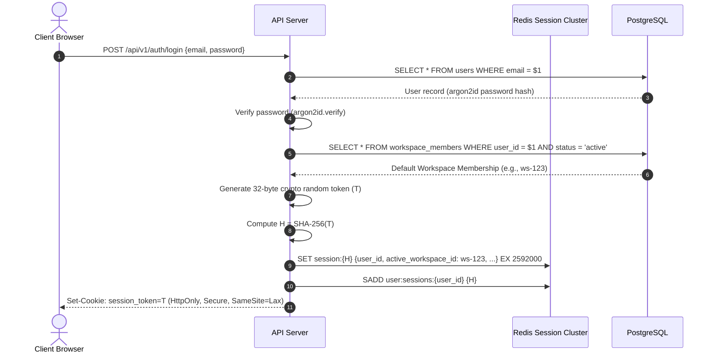
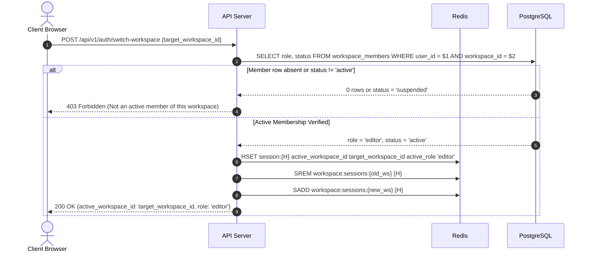
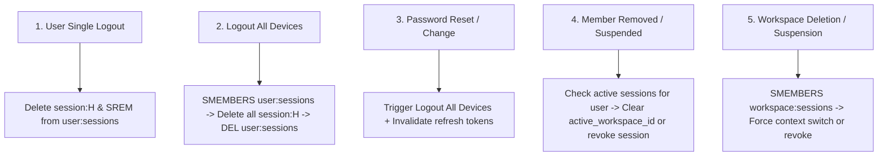

# SaaS Authentication and Session Architecture

## 1. Executive Summary

This document specifies the target authentication architecture and session management system for the multi-tenant Bengali-first Facebook Auto-Poster SaaS.

```
+-----------------------------------------------------------------------------+
|                            Authentication Status                            |
+--------------------------+--------------------------------------------------+
| CURRENT (Single-Tenant)  | In-memory JavaScript Map (sessionToken -> user), |
|                          | Lost on Node process restart, no workspace       |
|                          | binding, single operator context                 |
+--------------------------+--------------------------------------------------+
| TARGET (Multi-Tenant)    | Redis-backed opaque bearer sessions,             |
|                          | Only SHA-256 hashes stored, active workspace     |
|                          | context binding, dual timeout (absolute + idle), |
|                          | multi-device revocation tracking                 |
+--------------------------+--------------------------------------------------+
| DEFERRED                 | SAML 2.0 / Enterprise SSO, FIDO2 / WebAuthn,     |
|                          | social login (Sign-in with Google)               |
+--------------------------+--------------------------------------------------+
```

---

## 2. Session Architecture: Redis Opaque Sessions

In the target multi-tenant SaaS, stateless JWTs are explicitly rejected for user sessions (see ADR-002) in favor of **Redis-backed opaque sessions**.

### Key Rationale
- **Instant Revocation**: Crucial when a compromised account or removed workspace member must be locked out immediately without waiting for a token TTL to expire.
- **Dynamic Context**: Active workspace switches and role changes take effect immediately without requiring client-side token reissuance.
- **Zero Token Leakage in Database**: The raw session token is known only to the client; Redis stores only the cryptographically secure SHA-256 digest.



---

## 3. Session Token & Hash Specification

### Token Generation
- Length: 256 bits (32 bytes) of cryptographic randomness from `crypto.randomBytes(32)`.
- Format: Base64URL string (43 characters) or 64-character hexadecimal.
- Transport: Transmitted to client via `Set-Cookie`:
  ```http
  Set-Cookie: app_session=s_9f83a8f...; Path=/; HttpOnly; Secure; SameSite=Lax; Max-Age=2592000
  ```
  Or via `Authorization: Bearer s_9f83a8f...` header for API clients.

### Redis Storage Layout
The raw token `T` is **never stored** in Redis or PostgreSQL. Only its SHA-256 hash `H = SHA-256(T)` is persisted:

1. **Session Record Key**: `session:{H}`
   - Data Structure: Redis Hash or JSON string.
   - TTL: Set to Absolute Expiry (e.g., 30 days = 2,592,000 seconds).
   - Fields:
     ```json
     {
       "session_id": "ses_01951234-abcd-7890",
       "user_id": "usr_01951234-5678-9abc",
       "active_workspace_id": "wks_01951234-def0-1234",
       "active_role": "admin",
       "ip_address": "203.0.113.45",
       "user_agent": "Mozilla/5.0 ...",
       "created_at": "2026-09-04T12:00:00Z",
       "last_active_at": "2026-09-04T12:05:30Z",
       "expires_at": "2026-10-04T12:00:00Z"
     }
     ```

2. **User Session Index**: `user:sessions:{user_id}`
   - Data Structure: Redis Set of session hashes (`{H1, H2, ...}`).
   - Purpose: Enables "Logout All Devices" and password-reset revocation cascades.

3. **Workspace Session Index**: `workspace:sessions:{workspace_id}`
   - Data Structure: Redis Set of session hashes currently scoped to this workspace.
   - Purpose: Allows bulk invalidation or context clearing when a workspace is suspended or deactivated.

---

## 4. Lifecycle, Timeouts, and Rotation

### Dual-Timeout Policy
1. **Absolute Timeout (Max Lifetime)**:
   - Fixed at **30 days** (2,592,000 seconds) from session creation.
   - Stored in `expires_at`. The Redis key TTL is never extended past this absolute limit.
2. **Idle Timeout (Inactivity Sliding Window)**:
   - Configured at **24 hours** (86,400 seconds) of inactivity.
   - On each authenticated request:
     - Check: `now - last_active_at < 24 hours`.
     - If exceeded, delete `session:{H}` and return `401 Unauthorized (Session Expired Due to Inactivity)`.
     - Otherwise, update `last_active_at = now` (throttled to update Redis at most once every 60 seconds to reduce write load).

### Session Token Rotation
Session tokens are rotated (old token destroyed, new token issued) under the following conditions:
- **Privilege Elevation**: When an editor is promoted to admin or owner.
- **Active Workspace Switch**: Recommended to issue a rotated session token to prevent cross-tab race conditions.
- **Periodic Rotation**: Every 7 days during an active session to limit the window of token sniffing.

---

## 5. Active Workspace Binding and Switching

### Binding Rule
Every authenticated request executes strictly within the context of `session.active_workspace_id`.
- **CRITICAL**: The server **never trusts** `workspace_id` passed in request bodies or URL parameters for authorization.
- If a route URL contains a workspace parameter `/api/v1/workspaces/:workspaceId/...`, the route middleware verifies:
  ```javascript
  if (req.params.workspaceId !== req.session.active_workspace_id) {
    return res.status(409).json({
      error: 'WorkspaceContextMismatch',
      message: 'Active workspace context does not match requested resource path. Switch workspace first.'
    });
  }
  ```

### Workspace Switch Sequence
When a user switches between workspaces (e.g., from Kolkata Restaurant to Siliguri Boutique):


---

## 6. Revocation Cascades

The target architecture enforces comprehensive, immediate session revocation across 5 critical triggers:



### Revocation Trigger Specifications

1. **User Single Logout (`POST /api/v1/auth/logout`)**:
   - Compute hash `H = SHA-256(token)`.
   - Redis: `DEL session:{H}`, `SREM user:sessions:{user_id} {H}`, `SREM workspace:sessions:{workspace_id} {H}`.
   - Client: Clear cookie (`Max-Age=0`).

2. **Logout All Devices (`POST /api/v1/auth/logout-all`)**:
   - Fetch all session hashes: `hashes = SMEMBERS user:sessions:{user_id}`.
   - Delete all session records: `UNLINK session:{H1} session:{H2} ...`.
   - Delete user index: `DEL user:sessions:{user_id}`.

3. **Password Change or Account Recovery**:
   - Immediately execute "Logout All Devices" logic.
   - Issue one brand-new session token for the current client connection.

4. **Member Removal from Workspace**:
   - When an admin removes User X from Workspace W:
   - Database marks `workspace_members` row as `removed`.
   - Query all active sessions for User X from `user:sessions:{user_id}`.
   - For any session where `active_workspace_id === W`:
     - If User X has another active workspace, update session to that workspace.
     - If User X has no other active workspaces, delete the session.
   - Broadcast invalidation event over Redis Pub/Sub so all API worker instances drop in-memory authorization caches immediately.

5. **User Account Suspension**:
   - Database marks `users.status = 'suspended'`.
   - Immediately execute "Logout All Devices" and delete user session set.

---

## 7. Redis Outage & Resilience Behavior

### Availability Policy: Fail-Closed
Authentication and authorization state **must fail-closed**. If Redis is completely unreachable:
- The API server must **reject** requests with `503 Service Unavailable` (`Retry-After: 30`).
- **NEVER** fall back to bypassing session verification or assuming guest permissions for administrative routes.

### High-Availability Architecture
To ensure 99.95% uptime for the SaaS session store:
1. **Redis Sentinel or AWS ElastiCache / Redis Cluster**:
   - Primary-replica replication with automated multi-AZ failover (<15 seconds failover time).
2. **Connection Pooling & Circuit Breaking**:
   - Client library (`ioredis`) configured with retry strategies, reconnect timeouts, and command timeouts (200ms threshold).
   - If Redis connection drops, fast-fail health check `/health/readiness` to stop receiving load balancer traffic until failover completes.
3. **Graceful Error Handling**:
   - The auth middleware catches Redis connection errors and returns structured JSON:
     ```json
     {
       "error": "ServiceTemporarilyUnavailable",
       "message": "Authentication service is temporarily unavailable. Please retry in a few moments.",
       "code": "AUTH_REDIS_UNAVAILABLE"
     }
     ```
