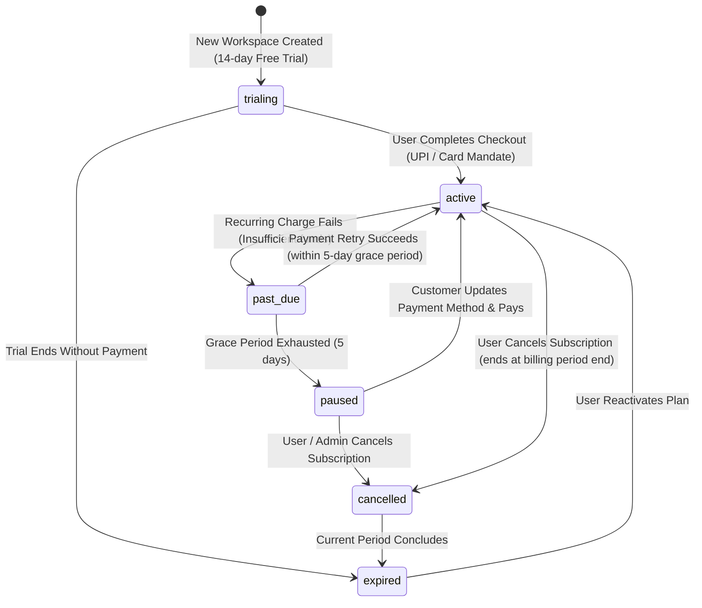
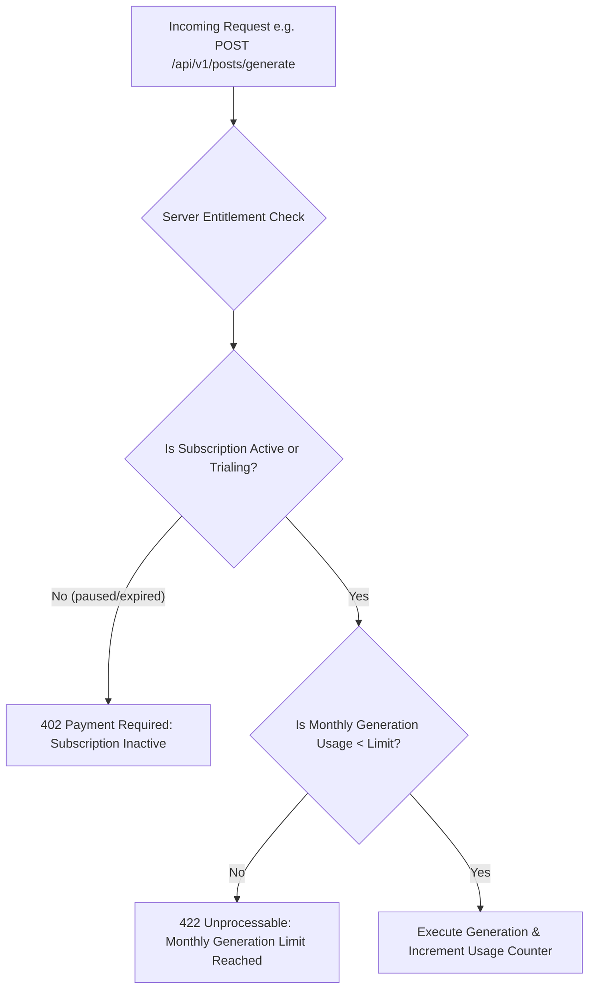
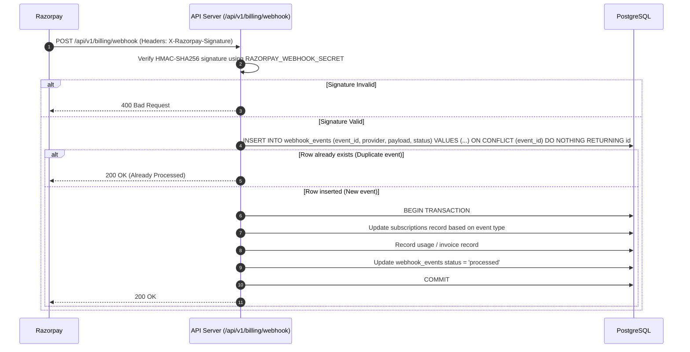

# Billing Model, Subscription Lifecycle, and Usage Metering

## 1. Executive Summary

This document specifies the billing architecture, provider selection, subscription state machine, usage dimensions, server-side entitlement enforcement, and idempotent webhook processing for the multi-tenant Bengali-first Facebook Auto-Poster SaaS.

```
+-----------------------------------------------------------------------------+
|                            Billing Architecture                             |
+--------------------------+--------------------------------------------------+
| CURRENT (Single-Tenant)  | Completely unmetered, no billing integration,    |
|                          | no concept of plans or subscriptions             |
+--------------------------+--------------------------------------------------+
| TARGET (Multi-Tenant)    | Razorpay Subscriptions (India-First),            |
|                          | INR currency, UPI AutoPay & e-Mandates, GST-ready|
|                          | 6 subscription states, strict server entitlement |
|                          | gates, idempotent webhook processing             |
+--------------------------+--------------------------------------------------+
| DEFERRED                 | Stripe Billing (Global expansion / USD),         |
|                          | Invoicing via Wire / PO for enterprise           |
+--------------------------+--------------------------------------------------+
```

---

## 2. Launch Provider Decision: Razorpay (India-First)

### Strategic Recommendation
For the initial SaaS launch, **Razorpay is the recommended and exclusive billing provider**. Implementing both Stripe and Razorpay concurrently in Phase 1 is explicitly rejected to avoid duplicate state synchronization and complex cross-gateway reconciliation (see ADR-005).

### Why Razorpay for Bengali Creators & Indian Local Businesses
1. **Payment Rail Dominance (UPI AutoPay)**:
   Over 70% of subscription purchases by Indian creators, coaching centre owners, and local boutique merchants occur over UPI rather than international credit cards. Razorpay provides native support for UPI AutoPay recurring mandates.
2. **RBI e-Mandate Compliance**:
   The Reserve Bank of India (RBI) mandates strict Additional Factor of Authentication (AFA) and pre-debit notifications (24 hours prior to charge) for recurring transactions. Razorpay manages this compliance lifecycle natively.
3. **Domestic Debit Cards & Netbanking**:
   Supports RuPay cards, local bank netbanking, and domestic debit cards that frequently fail on international gateways like Stripe.
4. **GST Invoicing**:
   Automatic generation of B2B GST tax invoices compliant with Indian tax laws.

### Deferred Provider: Stripe
Stripe integration is deferred to Phase 4 (Global Expansion) when targeting the Bengali diaspora in Bangladesh, the UK, the US, and Canada.

---

## 3. Subscription Lifecycle & State Machine



### State Definitions & System Behaviors

| Subscription State | Description | Scheduled Posting | Content Generation | Data Access |
| :--- | :--- | :---: | :---: | :---: |
| **trialing** | 14-day free evaluation period with Pro capabilities. | Enabled | Enabled (Trial quota) | Full Access |
| **active** | Recurring mandate in good standing. | Enabled | Enabled (Plan quota) | Full Access |
| **past_due** | Payment failed; system in 5-day grace period with automated retries. In-app warning banner displayed. | Enabled | Enabled | Full Access |
| **paused** | Grace period expired. Mandate suspended. | **Blocked** (Queued posts held) | **Blocked** | Read-Only |
| **cancelled** | User requested cancellation; remains active until current billing cycle concludes. | Enabled | Enabled | Full Access |
| **expired** | Billing period elapsed following cancellation or failed payment. | **Blocked** | **Blocked** | Read-Only (Export enabled) |

---

## 4. Plan Tiers & Usage Dimensions

The SaaS defines three initial pricing tiers tailored to creators and local businesses:

### Plan Matrix

| Dimension / Limit | Starter (₹999/mo) | Pro (₹2,499/mo) | Agency (₹6,999/mo) |
| :--- | :---: | :---: | :---: |
| **Target Audience** | Solo creators, single shops | Coaching centres, restaurants | Digital marketing agencies |
| **Connected Facebook Pages** | 1 | 5 | 20 |
| **Workspace Members** | 1 (Owner only) | 3 members | 10 members |
| **Scheduled Posts (Active Queue)**| Max 30 | Max 200 | Unlimited |
| **Monthly Content Generations** | 50 drafts | 300 drafts | 1,500 drafts |
| **Page DNA Profiles** | 1 | 5 (1 per page) | 20 (1 per page) |
| **Cloud Media Storage** | 1 GB | 10 GB | 50 GB |
| **Approval Workflows** | No (Direct posting) | Yes (Editor -> Approver) | Yes (Custom workflows) |
| **Bengali Dialect Variations** | Standard only | Standard + Regional | Custom Tone Models |

---

## 5. Server-Side Entitlement Checks

Client-side UI disabling is purely cosmetic. Every mutating action must pass a strict server-side entitlement gate prior to execution.



### Entitlement Middleware Implementation Pattern
```javascript
function requireEntitlement(dimension, amount = 1) {
  return async (req, res, next) => {
    const workspaceId = req.session.active_workspace_id;

    // 1. Fetch active subscription and plan limits
    const subscription = await billingRepo.getActiveSubscription(workspaceId);
    if (!subscription || !['trialing', 'active', 'past_due'].includes(subscription.status)) {
      return res.status(402).json({
        error: 'PaymentRequired',
        message: 'Active subscription required to perform this action.',
        code: 'SUBSCRIPTION_INACTIVE'
      });
    }

    // 2. Fetch current cycle usage
    const usage = await usageRepo.getCurrentUsage(workspaceId, dimension, subscription.current_period_start);
    const limit = subscription.plan.limits[dimension];

    if (limit !== -1 && (usage + amount) > limit) {
      return res.status(422).json({
        error: 'QuotaExceeded',
        message: `Workspace has reached the limit for ${dimension} (${limit}). Upgrade plan to proceed.`,
        code: 'QUOTA_EXCEEDED',
        dimension,
        current: usage,
        limit
      });
    }

    req.entitlement = { subscription, usage, limit };
    next();
  };
}
```

---

## 6. Idempotent Razorpay Webhook Processing

Razorpay delivers subscription lifecycle events (e.g., `subscription.charged`, `subscription.halted`, `payment.failed`) asynchronously. Webhook processing must be fully idempotent to handle duplicate deliveries and network retries gracefully.



### Critical Webhook Security Controls
1. **Signature Verification**:
   The incoming raw request body is verified against `X-Razorpay-Signature` using `crypto.createHmac('sha256', RAZORPAY_WEBHOOK_SECRET)`.
2. **Deduplication Key**:
   The unique `event_id` provided by Razorpay is stored with a `UNIQUE` database constraint in `webhook_events`. If a duplicate is received, the server responds `200 OK` immediately without re-executing state transitions.
3. **Out-of-Order Protection**:
   Events carry an `event_timestamp`. The database updates subscription status only if the webhook timestamp is newer than `subscriptions.updated_at`.
