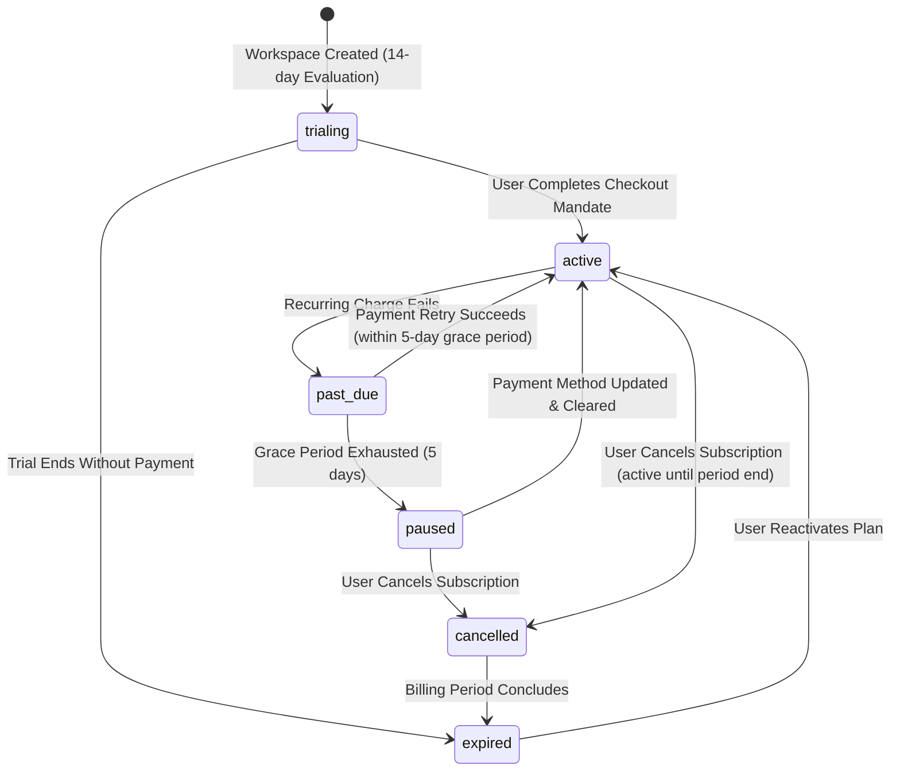
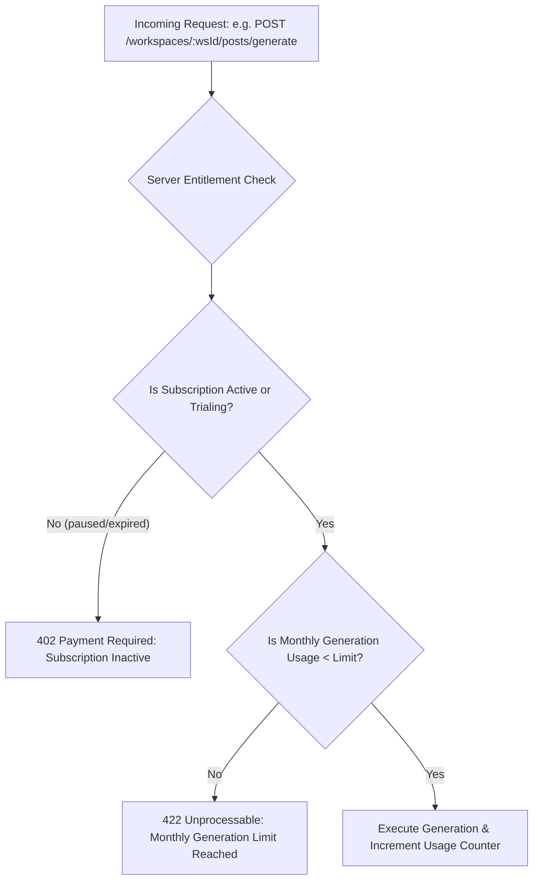
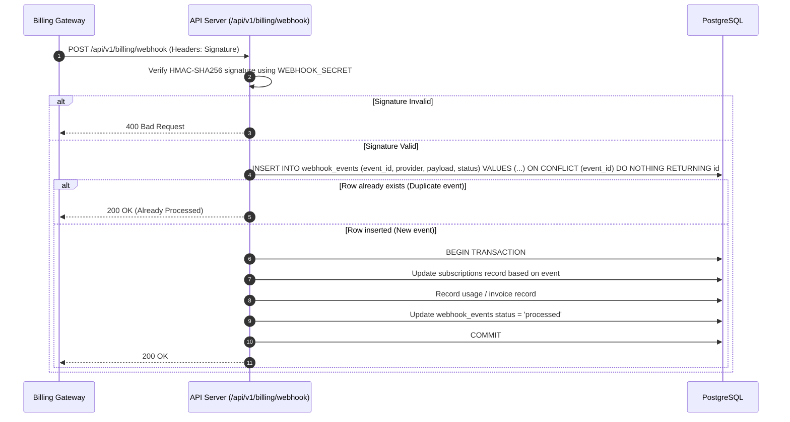

# Billing Model, Subscription Lifecycle, and Usage Metering

## 1. Executive Summary

This document specifies the billing architecture, proposed provider evaluation, subscription state machine, usage dimensions, server-side entitlement enforcement, and idempotent webhook processing for the multi-tenant Bengali-first Facebook Auto-Poster SaaS.

```
+-----------------------------------------------------------------------------+
|                            Billing Architecture                             |
+--------------------------+--------------------------------------------------+
| CURRENT (Single-Tenant)  | Completely unmetered, no billing integration,    |
|                          | no concept of plans or subscriptions             |
+--------------------------+--------------------------------------------------+
| TARGET (Multi-Tenant)    | Proposed India-First Billing (Razorpay),         |
|                          | INR currency, recurring mandates, entitlement    |
|                          | middleware, idempotent webhook deduplication     |
+--------------------------+--------------------------------------------------+
| DEFERRED                 | Global billing provider (Stripe / USD),          |
|                          | Enterprise invoicing via wire transfer           |
+--------------------------+--------------------------------------------------+
```

---

## 2. Proposed Launch Provider Evaluation: Razorpay (India-First)

### Strategic Context & Proposal
For the initial multi-tenant SaaS launch targeted at Bengali creators, coaching centres, restaurants, and local businesses in West Bengal and India, **Razorpay is proposed as the primary India-first billing provider**.

Implementing multiple payment gateways concurrently during MVP launch is explicitly rejected to avoid duplicate state synchronization and complex cross-gateway reconciliation (see ADR-005).

### Key Provider Capabilities Proposed
1. **Domestic Recurring Payment Support**:
   Supports domestic recurring payment mechanisms popular among Indian creators and merchants, including UPI AutoPay and bank e-mandates.
2. **Domestic Debit Cards & Netbanking**:
   Broad support for domestic RuPay cards, commercial debit cards, and local netbanking rails.
3. **Tax & Invoicing Support**:
   Provides invoice generation workflows suitable for Indian B2B Goods and Services Tax (GST) reporting.

### Validation Requirements (To Be Validated in Phase 4)
Prior to writing production billing code, the following aspects must be empirically validated in the Razorpay sandbox and merchant agreement:
- **Recurring Mandate Reliability**: Real-world success rates for UPI AutoPay versus credit/debit card e-mandates across major Indian banks.
- **Settlement Fees & Schedules**: Fee structure for recurring auto-debits and payout settlement timing.
- **GST Invoicing Compliance**: Exact invoice data format and compatibility with Indian tax filing requirements.
- **Refund & Dispute Flow**: Webhook events and API workflows for customer refunds and chargeback handling.
- **International Card Acceptance**: Capabilities and fees for accepting cards from the Bengali diaspora outside India (e.g. Bangladesh, UK, US).
- **Webhook Delivery & Retries**: Webhook delivery SLA, retry policies, and signature verification edge cases.
- **Subscription Lifecycle Control**: Behavior when pausing, resuming, or cancelling subscriptions mid-cycle.

### Deferred Provider: Stripe
Stripe integration is deferred to Phase 4 (Global Expansion) when actively marketing to overseas customers requiring USD, EUR, or GBP billing.

---

## 3. Subscription Lifecycle & State Machine



### State Definitions & Capabilities

| Subscription State | Description | Scheduled Posting | Content Generation | Data Access |
| :--- | :--- | :---: | :---: | :---: |
| **trialing** | 14-day free evaluation period with Pro capabilities. | Enabled | Enabled (Trial quota) | Full Access |
| **active** | Recurring mandate in good standing. | Enabled | Enabled (Plan quota) | Full Access |
| **past_due** | Payment failed; system in 5-day grace period with automated retries. In-app warning banner displayed. | Enabled | Enabled | Full Access |
| **paused** | Grace period expired. Mandate suspended. | **Blocked** (Queued posts held) | **Blocked** | Read-Only |
| **cancelled** | User requested cancellation; remains active until current billing cycle concludes. | Enabled | Enabled | Full Access |
| **expired** | Billing period elapsed following cancellation or failed payment. | **Blocked** | **Blocked** | Read-Only (Export enabled) |

---

## 4. Plan Tiers & Usage Dimensions

The SaaS defines three initial pricing tiers tailored to creators and local businesses:

### Plan Matrix (Pricing Proposed / To Be Validated)

| Dimension / Limit | Starter (₹999/mo) | Pro (₹2,499/mo) | Agency (₹6,999/mo) |
| :--- | :---: | :---: | :---: |
| **Target Audience** | Solo creators, single shops | Coaching centres, restaurants | Digital marketing agencies |
| **Connected Facebook Pages** | 1 | 5 | 20 |
| **Workspace Members** | 1 (Owner only) | 3 members | 10 members |
| **Scheduled Posts (Active Queue)**| Max 30 | Max 200 | Unlimited |
| **Monthly Content Generations** | 50 drafts | 300 drafts | 1,500 drafts |
| **Page DNA Profiles** | 1 | 5 (1 per page) | 20 (1 per page) |
| **Cloud Media Storage** | 1 GB | 10 GB | 50 GB |
| **Approval Workflows** | No (Direct posting) | Yes (Editor -> Reviewer) | Yes (Custom workflows) |
| **Bengali Dialect Variations** | Standard only | Standard + Regional | Custom Tone Models |

---

## 5. Server-Side Entitlement Checks

Client-side UI disabling is purely cosmetic. Every mutating action must pass a strict server-side entitlement gate prior to execution.



### Entitlement Middleware Pattern
```javascript
function requireEntitlement(dimension, amount = 1) {
  return async (req, res, next) => {
    const workspaceId = req.workspace.id;

    // 1. Fetch active subscription
    const subscription = await billingRepo.getActiveSubscription(workspaceId);
    if (!subscription || !['trialing', 'active', 'past_due'].includes(subscription.status)) {
      return res.status(402).json({
        error: 'PaymentRequired',
        message: 'Active subscription required to perform this action.',
        code: 'SUBSCRIPTION_INACTIVE'
      });
    }

    // 2. Fetch current cycle usage
    const usage = await usageRepo.getCurrentUsage(workspaceId, dimension, subscription.current_period_start);
    const limit = subscription.plan.limits[dimension];

    if (limit !== -1 && (usage + amount) > limit) {
      return res.status(422).json({
        error: 'QuotaExceeded',
        message: `Workspace has reached the limit for ${dimension} (${limit}). Upgrade plan to proceed.`,
        code: 'QUOTA_EXCEEDED',
        dimension,
        current: usage,
        limit
      });
    }

    req.entitlement = { subscription, usage, limit };
    next();
  };
}
```

---

## 6. Idempotent Webhook Processing

Billing lifecycle events (e.g. `subscription.charged`, `subscription.halted`, `payment.failed`) are delivered asynchronously via webhooks.



### Critical Webhook Security Controls
1. **Signature Verification**: Verified against the raw request body using HMAC-SHA256 and the gateway secret.
2. **Deduplication Key**: Unique `event_id` stored with a `UNIQUE` constraint in `webhook_events`. Duplicates receive an immediate `200 OK` without re-executing business logic.
3. **Out-of-Order Protection**: Webhook timestamp is compared against `subscriptions.updated_at` to prevent stale payloads from overwriting newer state.
