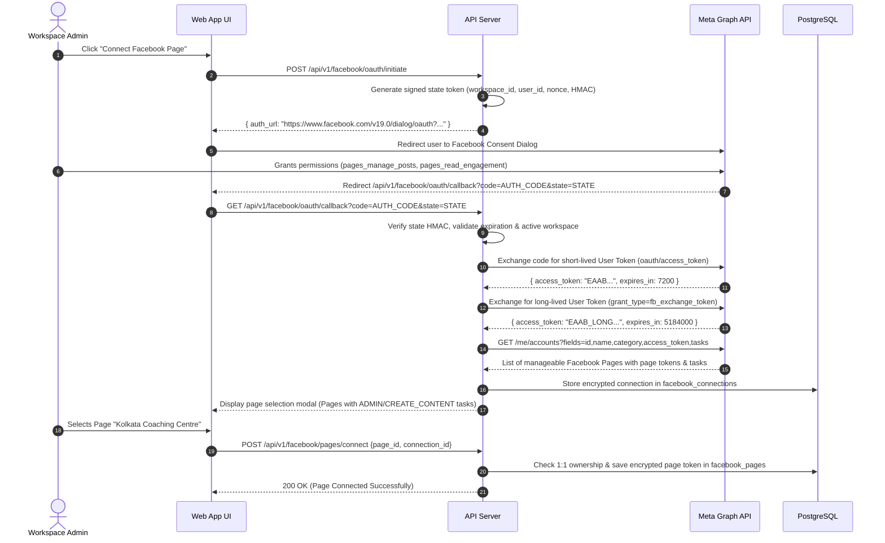
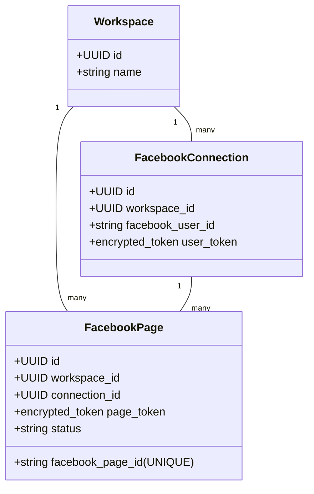

# Meta OAuth 2.0 and Facebook Page Ownership Design

## 1. Executive Summary

This document specifies the target Meta OAuth 2.0 integration, token lifecycle management, webhook tenant routing, data deletion compliance, and Facebook Page ownership model for the Bengali-first Facebook Auto-Poster SaaS.

```
+-----------------------------------------------------------------------------+
|                          Meta Integration Status                            |
+--------------------------+--------------------------------------------------+
| CURRENT (Single-Tenant)  | Manual long-lived PAGE_ACCESS_TOKEN and PAGE_ID  |
|                          | stored in .env, no OAuth flow, no page listing,  |
|                          | single Facebook Page per deployment              |
+--------------------------+--------------------------------------------------+
| TARGET (Multi-Tenant)    | Automated Meta OAuth 2.0 flow with HMAC state,   |
|                          | multi-page selection, long-lived token exchange, |
|                          | AES-256-GCM envelope encryption, 1:1 page-to-    |
|                          | workspace ownership, webhook tenant router       |
+--------------------------+--------------------------------------------------+
| DEFERRED                 | Instagram Graph API integration, Facebook Groups,|
|                          | Agency multi-workspace shared page delegation    |
+--------------------------+--------------------------------------------------+
```

---

## 2. Meta OAuth 2.0 Connection Lifecycle

The OAuth connection workflow securely bridges a user's Facebook identity and manageable business pages into a tenant workspace without exposing credentials to client browsers.



---

## 3. Detailed OAuth 2.0 Protocol Specification

### Step 1: OAuth Initiation & State Generation
- **Endpoint**: `POST /api/v1/facebook/oauth/initiate`
- **Authorization**: Requires role `owner` or `admin` in active workspace.
- **CSRF State Structure**:
  A tamper-proof JSON payload is constructed:
  ```json
  {
    "workspace_id": "wks_01951234-def0-1234",
    "user_id": "usr_01951234-5678-9abc",
    "nonce": "a7f3c1b82d4e5f...",
    "issued_at": 1725451200,
    "expires_at": 1725451800
  }
  ```
  The payload is signed using HMAC-SHA256 with the server's `OAUTH_STATE_SECRET` and base64url encoded:
  `state = base64url(payload) + "." + hmac_sha256(payload, secret)`
- **Scope Requested**:
  - `pages_show_list`
  - `pages_read_engagement`
  - `pages_manage_posts`
  - `public_profile`

### Step 2: Callback Validation & Token Exchange
- **Endpoint**: `GET /api/v1/facebook/oauth/callback`
- **State Validation**:
  - Split signature from state payload.
  - Verify HMAC signature. If invalid, abort with `400 Bad Request (Invalid OAuth State)`.
  - Verify `expires_at > now` (10-minute expiry window).
  - Verify `workspace_id === req.session.active_workspace_id`. If different, abort with `409 Conflict`.
- **Short-Lived User Token Exchange**:
  ```http
  GET https://graph.facebook.com/v19.0/oauth/access_token?
    client_id={app-id}&
    redirect_uri={redirect-uri}&
    client_secret={app-secret}&
    code={authorization-code}
  ```
- **Long-Lived User Token Exchange**:
  ```http
  GET https://graph.facebook.com/v19.0/oauth/access_token?
    grant_type=fb_exchange_token&
    client_id={app-id}&
    client_secret={app-secret}&
    fb_exchange_token={short-lived-user-token}
  ```
  Returns a 60-day long-lived User Access Token.

### Step 3: Page Listing & Permission Verification
- The server queries Meta Graph API:
  `GET https://graph.facebook.com/v19.0/me/accounts?fields=id,name,category,access_token,tasks`
- The server filters the accounts to ensure the user has sufficient capabilities:
  - Required tasks: `MANAGE` or `CREATE_CONTENT` or `MODERATE`.
- The server presents the list of eligible pages to the user.
- **CRITICAL**: The raw `access_token` for pages is kept in server memory during the selection flow and **never transmitted to the browser**.

### Step 4: Token Encryption & Persistence
- When the user selects a page to link:
  1. Generate a random 12-byte IV.
  2. Encrypt the page access token using AES-256-GCM and the KMS Data Encryption Key.
  3. Extract ciphertext and 16-byte authentication tag.
  4. Persist to `facebook_pages` table with `status = 'active'`.

---

## 4. Strict Facebook Page Ownership Model

### The 1:1 Workspace Ownership Rule
In MVP, **a Facebook Page belongs to exactly one workspace at any given time**.
- Enforced at the database level by a unique constraint:
  `CREATE UNIQUE INDEX idx_unique_active_facebook_page ON facebook_pages (facebook_page_id) WHERE status != 'disconnected';`



### Ownership Lifecycle & Conflict Scenarios

| Scenario | System Behavior | Recovery / User Flow |
| :--- | :--- | :--- |
| **Page already belongs to another workspace** | The connection attempt is **rejected** with error `409 Conflict: PAGE_ALREADY_CONNECTED`. | User is informed that the Page is active in another workspace. To transfer, the existing workspace owner must disconnect the page or the user must submit an administrative ownership challenge. |
| **Facebook connection token is revoked by user on Facebook** | Meta webhook sends `permissions` change event or next API call fails with error code `190` (Invalid OAuth Token). | System transitions `facebook_pages.status = 'token_expired'`. In-app alert notifies workspace admins: *"Facebook connection disconnected. Re-authenticate to resume scheduled posting."* Publishing paused. |
| **User loses Page Admin permission on Facebook** | Next token verification job or publish attempt returns Graph API error `(#200) Subject does not have permission to post`. | System marks `facebook_pages.status = 'permission_lost'`. Alert sent to workspace admins. Scheduled posts transition to `failed_permission`. |
| **Connecting user leaves workspace** | If the connecting user's account is removed or deleted: | If page has a permanent Page Access Token derived from a long-lived user token, publishing continues. However, an alert prompts remaining workspace admins to reconnect under an active member's Facebook account. |
| **Page is disconnected by Workspace Admin** | User clicks "Disconnect Page" in dashboard. | System executes Facebook Graph unsubscribe for webhooks: `DELETE /{page_id}/subscribed_apps`. Updates `facebook_pages.status = 'disconnected'` and zeroes out encrypted tokens. Any pending scheduled posts for that page are transitioned to `cancelled`. |
| **Workspace is deleted** | Entire workspace is soft-deleted or purged. | System cascades deletion: unlinks webhooks, deletes encrypted tokens from database, cancels all scheduled jobs in BullMQ. |

---

## 5. Token Expiration and Automated Health Checks

Even "never-expiring" Page Access Tokens can become invalidated if the underlying user changes their Facebook password, removes the app in Facebook Business Integrations, or if Meta triggers an automated security reset.

### Proactive Daily Token Health Worker
A daily background worker (`TokenHealthWorker`) iterates over all active `facebook_pages`:
1. Executes lightweight Graph API call: `GET /v19.0/{page-id}?fields=id,name`.
2. Inspects response headers (`X-App-Usage`, `X-Page-Usage`).
3. If token is valid, updates `facebook_pages.token_last_verified_at = now()`.
4. If token check fails with error `190` (subcode `458`, `460`, or `463`):
   - Updates `status = 'token_expired'`.
   - Emits internal notification to workspace owner and admins.
   - Pauses all pending scheduled posts for this page.

---

## 6. Webhook Tenant Resolution

Meta sends asynchronous webhook events for page updates, messages, feed changes, and permission revocations to a single configured callback URL.

### Webhook Processing Pipeline
```mermaid
flowchart TD
    MetaHook[Meta Webhook POST /api/v1/webhooks/facebook] --> SigCheck{Verify X-Hub-Signature-256}
    SigCheck -- Invalid --> R401[401 Unauthorized]
    SigCheck -- Valid --> FastAck[Immediate 200 OK to Meta]
    FastAck --> QueueJob[Enqueue in BullMQ: process-facebook-webhook]

    QueueJob --> Worker[Webhook Worker]
    Worker --> ExtractPage[Extract entry[i].id: facebook_page_id]
    Worker --> ResolveTenant[Query DB: SELECT workspace_id FROM facebook_pages WHERE facebook_page_id = $1]

    ResolveTenant -- Page Not Found --> LogDrop[Log Unmapped Page & Drop Event]
    ResolveTenant -- Found Workspace --> ProcessTenant[Process Event in Tenant Context]
```

1. **Signature Verification**:
   The webhook router verifies `X-Hub-Signature-256: sha256={hmac}` against `META_APP_SECRET`.
2. **Fast Acknowledgment**:
   Meta requires response within 5 seconds. The API responds `200 OK` immediately upon queuing the raw payload into Redis BullMQ.
3. **Tenant Resolution in Worker**:
   - The worker extracts `entry[].id` (which corresponds to `facebook_page_id`).
   - Executes single indexed lookup:
     `SELECT id, workspace_id, status FROM facebook_pages WHERE facebook_page_id = $1;`
   - Injects the resolved `workspace_id` into all downstream processing, audit logging, and notifications.

---

## 7. Meta Data Deletion Callback Compliance

Meta requires all applications requesting Facebook permissions to provide a user data deletion callback endpoint.

### Endpoint Specification
- **URL**: `POST /api/v1/webhooks/meta-data-deletion`
- **Protocol**:
  1. Meta sends a POST request containing `signed_request`.
  2. The server verifies the signature using `META_APP_SECRET`.
  3. The decoded payload contains `user_id` (the Facebook User ID).
  4. The server initiates an asynchronous data cleanup job:
     - Deletes or unlinks `facebook_connections` where `facebook_user_id = $1`.
     - Anonymizes or deletes any associated Facebook Page tokens.
     - Logs the compliance event with timestamp.
  5. The endpoint returns a JSON response containing a confirmation code and status URL:
     ```json
     {
       "url": "https://app.example.com/data-deletion/status?code=DEL_01951234abcd",
       "confirmation_code": "DEL_01951234abcd"
     }
     ```
