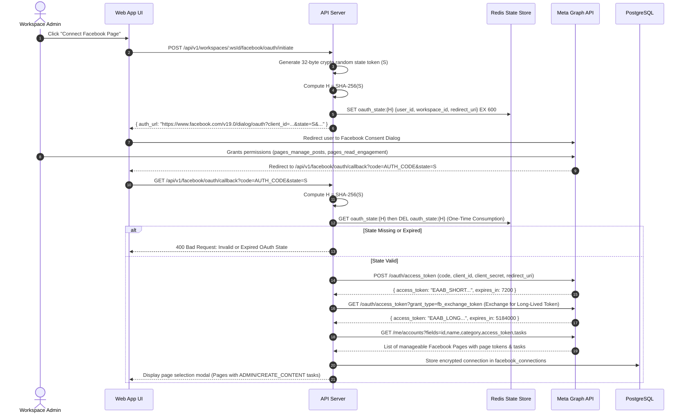
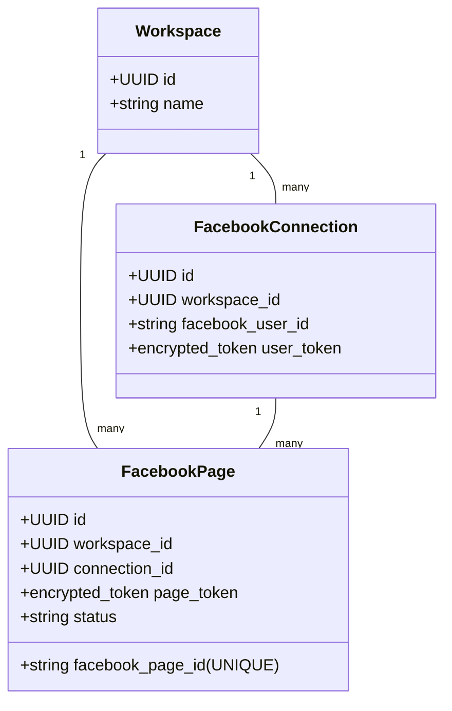
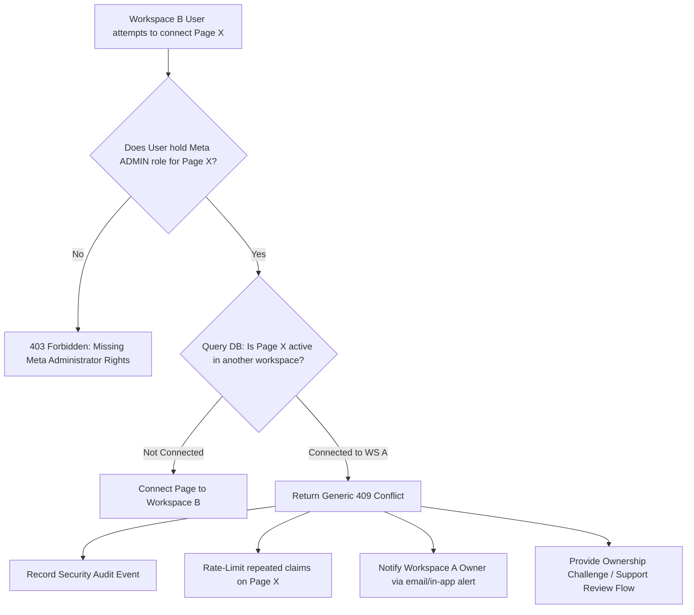

# Meta OAuth 2.0 and Facebook Page Ownership Design

## 1. Executive Summary

This document specifies the Meta OAuth 2.0 integration, token lifecycle management, webhook tenant routing, data deletion compliance, and privacy-safe Facebook Page ownership model for the Bengali-first Facebook Auto-Poster SaaS.

```
+-----------------------------------------------------------------------------+
|                          Meta Integration Status                            |
+--------------------------+--------------------------------------------------+
| CURRENT (Single-Tenant)  | Manual long-lived PAGE_ACCESS_TOKEN and PAGE_ID  |
|                          | in settings/env, no OAuth flow, single active    |
|                          | page at a time                                   |
+--------------------------+--------------------------------------------------+
| TARGET (Multi-Tenant)    | Meta OAuth 2.0 Authorization Code flow with      |
|                          | server-side hashed state, envelope encryption    |
|                          | (AES-256-GCM + KMS), strict 1:1 page ownership   |
|                          | with privacy-safe conflict resolution            |
+--------------------------+--------------------------------------------------+
| DEFERRED                 | Instagram Graph API integration, Facebook Groups,|
|                          | Multi-workspace shared page delegation           |
+--------------------------+--------------------------------------------------+
```

---

## 2. Meta OAuth 2.0 Connection Lifecycle

The connection workflow connects a user's Facebook identity and manageable business pages into a tenant workspace without exposing tokens to client browsers.



---

## 3. Detailed OAuth 2.0 Protocol & State Verification

### Step 1: OAuth Initiation & Server-Side Opaque State
- **Endpoint**: `POST /api/v1/workspaces/:workspaceId/facebook/oauth/initiate`
- **Authorization**: Requires role `owner` or `admin` in the requested workspace.
- **Server-Side Opaque State Protocol**:
  1. Generate 32 bytes of cryptographic randomness:
     `const state = crypto.randomBytes(32).toString('hex');` (256 bits of entropy).
  2. Compute hash: `const stateHash = crypto.createHash('sha256').update(state).digest('hex');`
  3. Store state record in Redis with a strict **10-minute TTL** (600 seconds):
     ```json
     {
       "user_id": "usr_01951234-5678-9abc",
       "workspace_id": "wks_01951234-def0-1234",
       "redirect_uri": "https://app.example.com/api/v1/facebook/oauth/callback",
       "created_at": 1725451200,
       "expires_at": 1725451800
     }
     ```
  4. **Privacy Benefit**: The client browser and Meta receive only the opaque random hex string. **No workspace ID, user ID, or internal metadata is exposed** inside readable state query parameters.

### Step 2: Callback Validation & One-Time State Consumption
- **Endpoint**: `GET /api/v1/facebook/oauth/callback?code={code}&state={state}`
- **One-Time Consumption & Validation**:
  1. Compute hash $H = \text{SHA-256}(\text{state})$.
  2. In an atomic Redis transaction (`GET` and `DEL`), retrieve and delete `oauth_state:{H}`.
  3. If state record is absent, expired, or already consumed, abort immediately:
     `400 Bad Request: Invalid or Expired OAuth State`.
  4. Verify that the user currently authenticated matches `record.user_id` and has active membership in `record.workspace_id`.
- **Authorization Code Exchange**:
  ```http
  POST https://graph.facebook.com/v19.0/oauth/access_token
  Content-Type: application/x-www-form-urlencoded

  client_id={app_id}&
  client_secret={app_secret}&
  redirect_uri={redirect_uri}&
  code={code}
  ```
- **PKCE Position**:
  For server-side confidential web applications communicating directly over TLS using a secure backend `client_secret`, Meta's canonical standard flow is the **OAuth 2.0 Authorization Code Flow**. PKCE is primarily designed for public clients (mobile or SPA applications without server backends). If Meta extends official PKCE support to confidential server flows, the state record can store the code verifier; until then, the confidential server-to-server code exchange is enforced.

### Step 3: Page Listing, Selection, and Envelope Encryption
1. Query Meta: `GET /me/accounts?fields=id,name,category,access_token,tasks`.
2. Filter accounts requiring `MANAGE` or `CREATE_CONTENT` tasks.
3. User selects the page to connect.
4. The page access token is encrypted using AES-256-GCM via KMS data keys before insertion into `facebook_pages`. The raw token is discarded from memory immediately.

---

## 4. Facebook Page Ownership & Privacy-Safe Conflict Model

### Strict 1:1 Workspace Ownership Rule
In MVP, **a Facebook Page can belong to exactly one workspace at a time**.
- Internal database identifier: `id UUID PRIMARY KEY`.
- Meta Facebook Page ID: `facebook_page_id VARCHAR(64) NOT NULL`.
- Database constraint:
  ```sql
  CREATE UNIQUE INDEX idx_unique_active_facebook_page
  ON facebook_pages (facebook_page_id)
  WHERE status != 'disconnected';
  ```
- Relational integrity: The `workspace_id` on `facebook_pages` must match the `workspace_id` on the parent `facebook_connections` row.



### Privacy-Safe Ownership Conflict Resolution Process
When Workspace B attempts to connect a Facebook Page that is already actively connected to Workspace A:



### Privacy & Security Rules During Conflict
1. **Administrative Pre-Verification**:
   Only a user who proves live Meta administrative control (holding a valid Meta User Access Token with `ADMINISTER` or `MANAGE` tasks for that page) may initiate connection or challenge.
2. **Zero Information Leakage**:
   The response to Workspace B **never reveals** Workspace A's name, owner name, email, member list, or connection timestamp.
3. **Generic Conflict Response**:
   The API responds with:
   ```json
   {
     "error": "PageAlreadyConnected",
     "message": "This Facebook Page is already connected to an existing workspace. If you believe this is in error, submit an ownership transfer request or contact workspace administrators.",
     "code": "PAGE_ALREADY_CONNECTED"
   }
   ```
4. **Discreet Notification to Existing Owner**:
   The existing Workspace A owner receives an alert:
   *"An administrator has requested connection of Page [Page Name]. If you transferred management, you may disconnect this page in Settings."* The requester's personal details are not exposed unnecessarily.
5. **Security Audit & Rate Limiting**:
   The conflict is logged in `audit_logs` with the requesting `user_id`, `workspace_id`, and `facebook_page_id`. Repeated connection attempts are rate-limited (max 3 claims per 24 hours per page) to prevent harassment.

---

## 5. Token Expiration and Automated Health Checks

Even long-lived Page Access Tokens become invalidated if the connecting user changes their Facebook password or Meta initiates a security reset.

### Proactive Daily Token Health Worker
A background worker (`TokenHealthWorker`) verifies token validity:
1. Executes lightweight Graph API call: `GET /v19.0/{page-id}?fields=id,name`.
2. Inspects response headers (`X-App-Usage`, `X-Page-Usage`).
3. If token check succeeds, updates `token_last_verified_at = NOW()`.
4. If token check fails with error `190` (subcodes `458`, `460`, `463`):
   - Updates `facebook_pages.status = 'token_expired'`.
   - Sends in-app alert to workspace admins: *"Facebook connection requires re-authentication."*
   - Pauses pending scheduled posts for that page.

---

## 6. Webhook Tenant Resolution

Meta sends asynchronous webhook events to a single configured endpoint.

```mermaid
flowchart TD
    MetaHook[Meta Webhook POST /api/v1/webhooks/facebook] --> SigCheck{Verify X-Hub-Signature-256}
    SigCheck -- Invalid --> R401[401 Unauthorized]
    SigCheck -- Valid --> FastAck[Immediate 200 OK to Meta]
    FastAck --> QueueJob[Enqueue in BullMQ: process-facebook-webhook]

    QueueJob --> Worker[Webhook Worker]
    Worker --> ExtractPage[Extract entry[i].id: facebook_page_id]
    Worker --> ResolveTenant[Query DB: SELECT workspace_id FROM facebook_pages WHERE facebook_page_id = $1]

    ResolveTenant -- Page Not Found --> LogDrop[Log Unmapped Page & Drop Event]
    ResolveTenant -- Found Workspace --> ProcessTenant[Process Event in Tenant Context]
```

1. **Signature Verification**: HMAC-SHA256 signature verified against `META_APP_SECRET`.
2. **Fast Acknowledgment**: Responds `200 OK` within 5 seconds; payload enqueued in Redis.
3. **Tenant Resolution in Worker**: Maps `entry[].id` against `facebook_pages.facebook_page_id`. Strict 1:1 ownership guarantees unambiguous workspace routing.

---

## 7. Meta Data Deletion Callback Compliance

Meta requires all applications to provide a user data deletion callback endpoint (`POST /api/v1/webhooks/meta-data-deletion`).

### Specification
1. Verifies `signed_request` HMAC using `META_APP_SECRET`.
2. Decodes `user_id` (Facebook User ID).
3. Enqueues an asynchronous data scrub job:
   - Deletes or unlinks `facebook_connections` where `facebook_user_id = $1`.
   - Soft-deletes associated Facebook Page tokens.
4. Responds with confirmation JSON:
   ```json
   {
     "url": "https://app.example.com/data-deletion/status?code=DEL_01951234abcd",
     "confirmation_code": "DEL_01951234abcd"
     }
   ```
