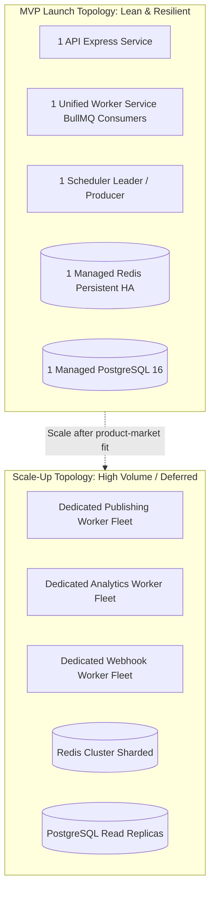
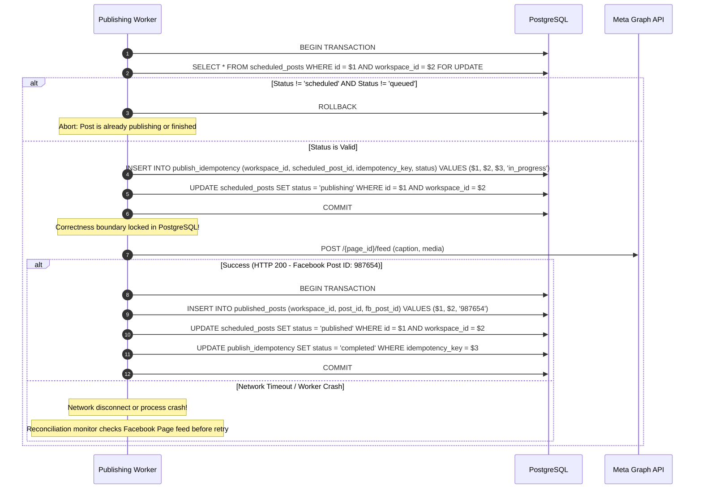

# Background Job Processing and Worker Architecture

## 1. Executive Summary

This document specifies the distributed background job architecture, worker decomposition, PostgreSQL idempotency boundaries, retry policies, distributed locking, safe telemetry logging, and Facebook Graph API rate-limiting strategies for the multi-tenant Bengali-first Facebook Auto-Poster SaaS.

```
+-----------------------------------------------------------------------------+
|                          Job Processing Status                              |
+--------------------------+--------------------------------------------------+
| CURRENT (Single-Tenant)  | In-process node-cron and setInterval timers in   |
|                          | services/scheduler.js, lost on process restart,  |
|                          | no retry backoff, no DLQ, no distributed locking |
+--------------------------+--------------------------------------------------+
| TARGET (Multi-Tenant)    | PostgreSQL idempotency correctness boundary,     |
|                          | Redis + BullMQ worker service, Redlock lock      |
|                          | optimization, safe attempt redaction, Graph API  |
|                          | rate-limit throttling, dead-letter queues        |
+--------------------------+--------------------------------------------------+
| DEFERRED                 | Dedicated multi-fleet worker autoscaling,        |
|                          | sharded Redis Cluster, cross-region queue sync   |
+--------------------------+--------------------------------------------------+
```

---

## 2. Infrastructure Right-Sizing: MVP vs Scale-Up

To avoid unnecessary operational complexity during early validation, the background architecture is right-sized for MVP launch and scaled horizontally only as volume demands:



### MVP Worker Topology
- **Unified Worker Service**: A single containerized Node.js service running BullMQ consumers for all three queues: `publishing-queue`, `analytics-queue`, and `webhook-queue`.
- **Concurrency**: Configured with a worker concurrency limit (e.g. 5 concurrent jobs) and tenant concurrency caps.
- **Persistence**: Single managed Redis instance with persistence (AOF/RDB) and high-availability automated failover.

### Scale-Up Fleet Topology (Deferred)
- Separate container pools for publishing, analytics, and webhooks.
- Multi-node Redis Cluster with queue partitioning.

---

## 3. Database Idempotency as Correctness Boundary

While Redis distributed locks (Redlock) are utilized to minimize concurrent worker contention, **PostgreSQL is the definitive source of truth and correctness boundary for duplicate prevention**.



### Database Idempotency Protocol
1. **Row-Level Lock**: Worker opens a transaction and executes `SELECT * FROM scheduled_posts WHERE id = $1 AND workspace_id = $2 FOR UPDATE`.
2. **State Guard**: If `status` is not `scheduled` or `queued`, the transaction rolls back immediately.
3. **Idempotency Record Claim**: The worker inserts a claim into `publish_idempotency`:
   `CONSTRAINT uq_publish_idempotency UNIQUE (workspace_id, idempotency_key)`.
   If a row already exists, the insert fails with a unique constraint violation.
4. **Transition to `publishing`**: `scheduled_posts.status` transitions to `publishing` and the transaction commits.
5. **Facebook Call**: Worker performs the Graph API call.
6. **Outcome Persistence**: In a closing transaction, `published_posts` is created, `scheduled_posts.status` becomes `published`, and `publish_idempotency.status` becomes `completed`.

### Worker Crash Reconciliation
If a worker crashes between the Facebook call and database update:
1. The post remains in `publishing` state.
2. A periodic reconciliation worker identifies posts stuck in `publishing` for longer than 5 minutes.
3. The reconciliation worker queries the Facebook Page feed: `GET /{page_id}/feed?limit=5&fields=id,message,created_time`.
4. If a published post matches the post caption and timestamp window:
   - The monitor marks `published_posts` and updates `scheduled_posts.status = 'published'`.
5. If no matching post exists on Facebook:
   - The monitor safely resets `scheduled_posts.status = 'queued'` to allow the scheduler to re-dispatch the job.

---

## 4. Safe Telemetry and Publish Attempt Logging

### Security & Privacy Rules
To protect credentials and customer confidentiality, storing raw HTTP payloads or tokens in attempt logs is strictly prohibited:

| Prohibited Data | Prevention & Sanitization Strategy |
| :--- | :--- |
| **`Authorization` headers & tokens** | Completely stripped by telemetry filter prior to logging. |
| **Facebook Page / User Access Tokens** | URL query parameters sanitized; tokens replaced with `[REDACTED]`. |
| **Session cookies** | Excluded from worker telemetry models entirely. |
| **Raw request / response bodies** | Discarded; only structured error codes (`fb_error_code`, `fb_error_subcode`) and high-level messages are kept. |
| **Internal exception dumps** | Stack traces containing local environment variables or secrets are intercepted and sanitized. |

### Canonical `publish_attempts` Telemetry Schema
```sql
CREATE TABLE publish_attempts (
    id UUID PRIMARY KEY,
    workspace_id UUID NOT NULL REFERENCES workspaces(id) ON DELETE CASCADE,
    scheduled_post_id UUID NOT NULL REFERENCES scheduled_posts(id) ON DELETE CASCADE,
    post_version_id UUID NOT NULL REFERENCES post_versions(id) ON DELETE CASCADE,
    attempt_number INT NOT NULL,
    endpoint VARCHAR(128) NOT NULL, -- e.g. "POST /{page_id}/feed"
    http_status INT,                -- e.g. 200, 400, 429
    fb_error_code INT,             -- e.g. 190, 32
    fb_error_subcode INT,          -- e.g. 463
    error_category VARCHAR(64),    -- e.g. "TOKEN_EXPIRED", "RATE_LIMIT", "TIMEOUT"
    duration_ms INT NOT NULL,
    retry_decision VARCHAR(32) NOT NULL, -- "RETRY_SCHEDULED", "MOVED_TO_DLQ", "ABORTED"
    trace_id VARCHAR(64) NOT NULL,
    created_at TIMESTAMPTZ NOT NULL DEFAULT NOW(),
    CONSTRAINT fk_publish_attempts_workspace
        FOREIGN KEY (workspace_id, scheduled_post_id)
        REFERENCES scheduled_posts(workspace_id, id)
);
```

---

## 5. Publishing Job Payload Schema

Every job dispatched to BullMQ carries a strictly validated payload:

```json
{
  "$schema": "https://json-schema.org/draft/2020-12/schema",
  "title": "PublishingJobPayload",
  "type": "object",
  "required": [
    "workspaceId",
    "facebookPageId",
    "scheduledPostId",
    "postVersionId",
    "idempotencyKey",
    "attemptNumber",
    "traceId"
  ],
  "properties": {
    "workspaceId": {
      "type": "string",
      "format": "uuid"
    },
    "facebookPageId": {
      "type": "string",
      "format": "uuid"
    },
    "scheduledPostId": {
      "type": "string",
      "format": "uuid"
    },
    "postVersionId": {
      "type": "string",
      "format": "uuid"
    },
    "idempotencyKey": {
      "type": "string"
    },
    "attemptNumber": {
      "type": "integer",
      "minimum": 1
    },
    "traceId": {
      "type": "string"
    }
  },
  "additionalProperties": false
}
```

---

## 6. Graph API Rate-Limit Throttling and Backoff

Meta enforces rate limits per App and per Page. Workers actively monitor rate limit headers returned on every Graph API call:

### Meta Rate Limit Headers
- `X-App-Usage`: `{"call_count": 85, "total_cputime": 40, "total_time": 50}`
- `X-Page-Usage`: `{"call_count": 92, "total_cputime": 30, "total_time": 75}`

### Throttling & Backoff Rules
1. **Proactive Throttling**: If any percentage in `X-Page-Usage` exceeds **80%**, pause subsequent jobs for that page by 5 minutes.
2. **Error Code Handling**:
   - Error `4` (App rate limit): Backoff application-wide publishing by 15 minutes.
   - Error `17` (User rate limit): Backoff user connection by 15 minutes.
   - Error `32` (Page rate limit): Backoff page jobs by 30 minutes.
   - Error `613` (Calls exceeded limit): Backoff page jobs by 15 minutes.
3. **Exponential Backoff Schedule with Jitter**:
   - Attempt 1: 1 min + jitter (0-30s)
   - Attempt 2: 5 min + jitter (0-60s)
   - Attempt 3: 15 min + jitter (0-120s)
   - Attempt 4: 30 min + jitter (0-300s)
   - Attempt 5: 60 min.
   - After 5 Attempts: Move job to Dead-Letter Queue (DLQ), notify workspace reviewer/admin.

---

## 7. Graceful Worker Shutdown

Workers must support rolling deployments without interrupting active publishing jobs:
1. Listen for `SIGTERM` and `SIGINT`.
2. Pause queues immediately: `await worker.pause()`.
3. Allow active jobs up to **30 seconds** to complete Facebook publishing and PostgreSQL status commits.
4. Release distributed locks and exit cleanly with code 0.
