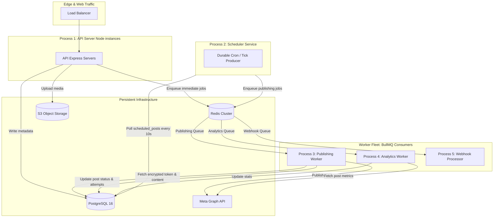
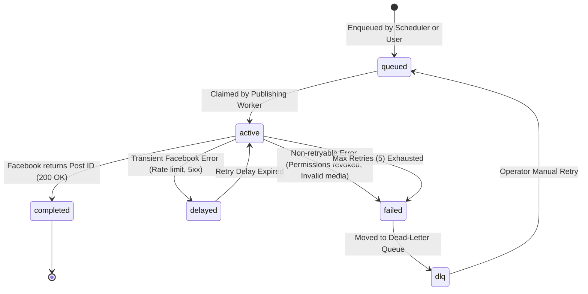
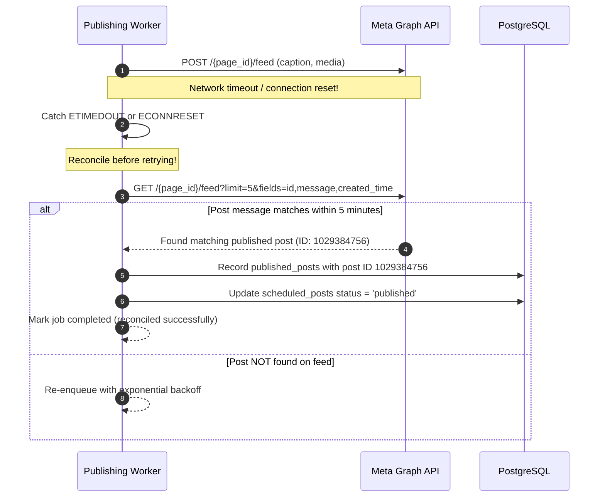

# Background Job Processing and Worker Architecture

## 1. Executive Summary

This document specifies the distributed background job architecture, worker decomposition, retry policies, distributed locking, and Facebook Graph API rate-limiting strategies for the multi-tenant Bengali-first Facebook Auto-Poster SaaS.

```
+-----------------------------------------------------------------------------+
|                          Job Processing Status                              |
+--------------------------+--------------------------------------------------+
| CURRENT (Single-Tenant)  | In-process Node.js setTimeout / node-cron timer, |
|                          | Lost entirely on process crash or restart,       |
|                          | No retry backoff, no DLQ, no distributed locking |
+--------------------------+--------------------------------------------------+
| TARGET (Multi-Tenant)    | Separate process topology, Redis + BullMQ,       |
|                          | Redlock distributed locking per page/post,       |
|                          | Exponential backoff with jitter, DLQ alerting,   |
|                          | Multi-tenant fair queuing & Graph API throttling |
+--------------------------+--------------------------------------------------+
| DEFERRED                 | Cross-region active-active queue replication,    |
|                          | Dynamic AI model auto-scaling worker pools       |
+--------------------------+--------------------------------------------------+
```

---

## 2. Process Decomposition & Topologies

To guarantee reliability, resource isolation, and horizontal scalability, the system divides workloads across 5 distinct process types:



### Process Descriptions

1. **API Server (`web`)**: Stateless Express instances. Handles HTTP authentication, UI requests, content creation, manual approval triggers, and file uploads. Enqueues background tasks; never executes heavy publishing or external polling synchronously.
2. **Scheduler Service (`scheduler`)**: A single lightweight leader-elected instance (or cron-based producer). Scans `scheduled_posts` in PostgreSQL for items due within the next 60 seconds and pushes them into the Redis BullMQ queue with exact execution timestamps.
3. **Publishing Worker (`worker-publishing`)**: Dedicated consumer pool for publishing content to Facebook. Manages token decryption, media asset fetching from S3, Facebook Graph API requests, rate-limit backoff, and state transitions.
4. **Analytics Worker (`worker-analytics`)**: Batched consumer for fetching engagement metrics (reactions, shares, comments) from Facebook Graph API without blocking publishing queues.
5. **Webhook Processor (`worker-webhooks`)**: Dedicated consumer processing incoming Meta webhooks (page feed updates, comments, permission drops) asynchronously.

---

## 3. Publishing Job Payload Schema

Every job dispatched to the publishing queue must carry a strictly typed, immutable payload:

```json
{
  "$schema": "https://json-schema.org/draft/2020-12/schema",
  "title": "PublishingJobPayload",
  "type": "object",
  "required": [
    "workspaceId",
    "facebookPageId",
    "scheduledPostId",
    "postVersionId",
    "idempotencyKey",
    "attemptNumber",
    "traceId"
  ],
  "properties": {
    "workspaceId": {
      "type": "string",
      "format": "uuid",
      "description": "Tenant workspace owning this publishing action."
    },
    "facebookPageId": {
      "type": "string",
      "format": "uuid",
      "description": "Internal database UUID of the target facebook_pages record."
    },
    "scheduledPostId": {
      "type": "string",
      "format": "uuid",
      "description": "Primary key of the scheduled_posts record."
    },
    "postVersionId": {
      "type": "string",
      "format": "uuid",
      "description": "Exact immutable snapshot version of post content being published."
    },
    "idempotencyKey": {
      "type": "string",
      "description": "Unique key (e.g., pub_ws123_sched456_attempt1) preventing duplicate Facebook posts."
    },
    "attemptNumber": {
      "type": "integer",
      "minimum": 1,
      "description": "Current attempt counter (1, 2, 3...)."
    },
    "traceId": {
      "type": "string",
      "description": "Distributed tracing ID propagated from originating user action."
    }
  },
  "additionalProperties": false
}
```

---

## 4. Job Lifecycle & State Machine



### State Definitions
- `queued`: Job resides in Redis BullMQ awaiting available worker concurrency.
- `active`: Worker has acquired distributed lock and is decrypting token / calling Facebook.
- `completed`: Successfully published. `published_posts` record created; `scheduled_posts.status = 'published'`.
- `delayed`: Post encountered transient network failure or rate limit; waiting exponential backoff.
- `failed`: Terminal failure recorded in `publish_attempts`. Alerts triggered.
- `dlq`: Sits in Dead-Letter Queue for operator investigation.

---

## 5. Distributed Locking (Redlock)

To prevent duplicate Facebook posts caused by network hiccups, overlapping cron schedules, or simultaneous worker claims, the publishing worker must acquire two distributed locks:

1. **Page-Level Lock**: `lock:fb_page:{facebookPageId}`
   - Prevents posting multiple updates simultaneously to the same Facebook Page (avoids triggering Meta's spam/burst filters).
   - TTL: 30 seconds.
2. **Post-Level Lock**: `lock:scheduled_post:{scheduledPostId}`
   - Guarantees that only one worker can process a specific scheduled post at any given second.
   - TTL: 60 seconds.

### Lock Acquisition Protocol
```javascript
const pageLock = await redlock.acquire([`lock:fb_page:${job.facebookPageId}`], 30000);
try {
  const postLock = await redlock.acquire([`lock:scheduled_post:${job.scheduledPostId}`], 60000);
  try {
    await executePublish(job);
  } finally {
    await postLock.release();
  }
} finally {
  await pageLock.release();
}
```

---

## 6. Graph API Rate Limit Throttling and Backoff

Meta enforces rate limits per App and per Page. Workers must actively monitor rate limit headers returned on every Graph API response.

### Meta Rate Limit Headers
- `X-App-Usage`: `{"call_count": 85, "total_cputime": 40, "total_time": 50}`
- `X-Page-Usage`: `{"call_count": 92, "total_cputime": 30, "total_time": 75}`

### Throttling Rules
1. If any metric in `X-Page-Usage` or `X-App-Usage` exceeds **80%**:
   - The worker enters proactive throttling: pauses new jobs for that page for 5 minutes.
2. If Graph API returns error codes:
   - Error `4` (Application request limit reached): Backoff application-wide publishing by 15 minutes.
   - Error `17` (User request limit reached): Pause jobs for this user connection by 15 minutes.
   - Error `32` (Page request limit reached): Pause jobs for this specific Facebook Page by 30 minutes.
   - Error `613` (Calls have exceeded rate limits): Pause jobs for this page by 15 minutes.

### Retry Backoff Schedule
For retryable network errors (HTTP 500, 502, 503, 504, timeout):
- **Attempt 1**: Retry after 1 minute + random jitter (0-30s)
- **Attempt 2**: Retry after 5 minutes + random jitter (0-60s)
- **Attempt 3**: Retry after 15 minutes + random jitter (0-120s)
- **Attempt 4**: Retry after 30 minutes + random jitter (0-300s)
- **Attempt 5**: Retry after 60 minutes.
- **After 5 Attempts**: Mark post `failed`, push to Dead-Letter Queue (DLQ), notify workspace admins.

---

## 7. Multi-Tenant Fair Queuing

In a shared queue, a large agency tenant scheduling 500 posts at 9:00 AM must not starve a small boutique tenant scheduling 1 post at 9:01 AM.

### Isolation Strategies
1. **Tenant Concurrency Limits**:
   - BullMQ Group / Child Queues: Max concurrent publishing jobs per `workspaceId` = 2.
2. **Priority Tiers by Plan**:
   - Pro and Agency plans get priority weighting (`priority: 1` vs Starter `priority: 5`).
3. **Queue Separation**:
   - High-priority interactive manual publishing queue (`publish-interactive`).
   - Normal scheduled posting queue (`publish-scheduled`).
   - Bulk / agency queue (`publish-bulk`).

---

## 8. Network Timeout, Reconciliation, and Partial Failure

### The "Zombie Post" Problem
A network timeout occurs after Meta successfully writes the post to Facebook but before the worker receives the HTTP 200 response. If the worker simply retries, a duplicate post is created on Facebook.

### Reconciliation Sequence


---

## 9. Graceful Worker Shutdown

Workers must support zero-downtime rolling deployments without dropping active publishing tasks.

### Shutdown Protocol
1. Listen for `SIGTERM` and `SIGINT` signals.
2. Stop accepting new jobs: `await queue.pause()`.
3. Allow active jobs up to **30 seconds** to complete publishing and database state persistence.
4. If active jobs finish within timeout: release distributed locks and exit with code 0.
5. If timeout expires before job completion: log error alert, discard lock safely, and exit with code 1 so container orchestrator restarts instance.
