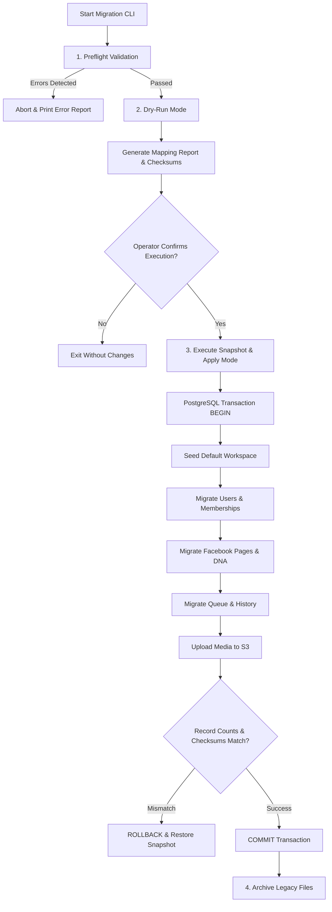

# SaaS Migration Plan and Legacy Data Transition

## 1. Executive Summary

This document specifies the safe migration strategy from the single-tenant file-based architecture to the multi-tenant PostgreSQL, Redis, and Object Storage SaaS architecture. It provides an exhaustive audit of legacy storage, defines a two-phase CLI migration runner (preflight, dry-run, apply, rollback), outlines legacy workspace seeding, and evaluates the SaaS architectural impact on Page DNA (PR #2).

```
+-----------------------------------------------------------------------------+
|                              Migration Status                               |
+--------------------------+--------------------------------------------------+
| CURRENT (Single-Tenant)  | Flat JSON files in data/, local files in uploads/|
|                          | Abandoned SQLite in services/db.js               |
+--------------------------+--------------------------------------------------+
| TARGET (Multi-Tenant)    | PostgreSQL 16 (Relational/ACID), Redis Cluster   |
|                          | (Queues & Sessions), S3 (Media), Zero JSON data  |
+--------------------------+--------------------------------------------------+
| DEFERRED                 | Live zero-downtime dual-write replication        |
+--------------------------+--------------------------------------------------+
```

---

## 2. Legacy Single-Tenant Data Audit

An exhaustive audit of the existing codebase reveals 7 legacy storage locations:

| Storage Artifact | Format & Location | Contents & Structure | SaaS Target Entity |
| :--- | :--- | :--- | :--- |
| **User Store** | `data/users.json` | Array of `{ id, username, passwordHash, role, createdAt }` | `users` + `workspace_members` |
| **Settings Store** | `data/settings.json` | Global object `{ facebook: { pageId, ... }, ai: { ... }, schedule: { ... } }` | `facebook_pages` + `workspace_settings` |
| **Queue Store** | `data/queue.json` | Array of scheduled post objects `{ id, topic, caption, scheduledTime, status }` | `content_posts` + `scheduled_posts` |
| **History Store** | `data/history.json` | Array of published post logs `{ id, topic, caption, publishedAt, fbPostId }` | `content_posts` + `published_posts` |
| **Page Profile** | `data/profile.json` (PR #2) | Single Page DNA object `{ brandName, tone, primaryGoal, audience, ... }` | `page_dna_profiles` |
| **Profile Backups** | `data/profile-backups/*.json` (PR #2) | Plaintext JSON timestamped snapshots | `page_dna_versions` (in PostgreSQL) |
| **Media Assets** | `uploads/*` | Local disk files (JPEG, PNG) | Private S3 Bucket + `media_assets` |
| **Abandoned DB** | `services/db.js` (`data/saas.db`) | Unused, unimported SQLite database schema | **Discard / Do Not Migrate** |

### Abandoned Database Notice (`services/db.js`)
Code inspection shows `services/db.js` sets up a SQLite database with `users` and `user_settings` tables. However, this file is **completely unused and unimported** across the application. The running application relies exclusively on `services/storage.js` and flat JSON files. The abandoned SQLite file must be ignored during migration.

---

## 3. Migration Principles & Strict Operator Controls

To prevent data corruption, partial state loss, or accidental credential leaks:
1. **No Automatic Migration on Startup**: The server must **never** auto-migrate data on application boot.
2. **Explicit Operator Command Required**: Migration must be executed explicitly via CLI by an authorized systems engineer:
   `node scripts/migrate-to-saas.js --dry-run`
3. **Mandatory Preflight & Snapshot**: Migration aborts immediately if database connections fail or if preflight checksums do not match.
4. **All Operations Transactional**: All database inserts execute within a single PostgreSQL transaction (`BEGIN ... COMMIT`). If an error occurs, the transaction rolls back completely.
5. **Secret Redaction**: Migration logs must redact all Facebook tokens, passwords, and API keys.

---

## 4. The Two-Phase Migration Runner CLI

The migration CLI (`scripts/migrate-to-saas.js`) operates in four sequential modes:



### Mode 1: Preflight Validation
- Validates PostgreSQL connectivity, schema migrations, and KMS encryption service reachability.
- Inspects `data/` directory: checks read permissions, parses every JSON file, validates schema sanity.
- Inspects `uploads/`: verifies file integrity and readability.

### Mode 2: Dry-Run Mode (`--dry-run`)
- Executes all mapping logic in memory without writing to PostgreSQL or S3.
- Generates a detailed **Migration Mapping Report**:
  - Total users to migrate.
  - Legacy post ID -> Target UUID mappings.
  - Legacy page ID -> Target Facebook Page entity.
  - File size and count of media assets.
  - Warnings for invalid or orphaned records.

### Mode 3: Apply Mode (`--apply`)
- Creates a timestamped tarball backup of `data/` and `uploads/` (`backup_pre_saas_<timestamp>.tar.gz`) with SHA-256 manifest.
- Opens a PostgreSQL transaction.
- Seeds the initial Default Legacy Workspace (see Section 5).
- Inserts mapped entities.
- Uploads local media files to S3 bucket under `workspaces/{workspace_id}/...`.
- Verifies record counts against the preflight report.
- Commits transaction.

### Mode 4: Rollback Mode (`--rollback`)
- If verification fails or post-migration testing uncovers issues:
  - Truncates newly populated tables for the legacy workspace.
  - Restores flat files from the pre-migration snapshot tarball.
  - Resets application config to file-based mode.

---

## 5. Legacy Single-Tenant Workspace Seeding

Because legacy data lacks tenant context, the migration maps all existing single-tenant assets into **one canonical default workspace**:

```mermaid
flowchart LR
    subgraph Legacy [Legacy Data]
        LU[data/users.json: admin]
        LS[data/settings.json]
        LQ[data/queue.json]
        LH[data/history.json]
        LP[data/profile.json]
    end

    subgraph Target [PostgreSQL Entities]
        WS[(Default Workspace: "Legacy Workspace")]
        TU[(User: admin - Role: OWNER)]
        TP[(Facebook Page: Linked to WS)]
        TD[(Page DNA Profile: Linked to Page)]
        TC[(Content Posts & Scheduled Posts)]
    end

    LU --> TU
    TU -->|Owner of| WS
    LS --> TP
    TP -->|Belongs to| WS
    LP --> TD
    TD -->|Belongs to| TP
    LQ --> TC
    LH --> TC
    TC -->|Belongs to| WS
```

### Seeding Rules
1. **Workspace Entity**:
   - Name: `"Primary Workspace"` (or configured via `--workspace-name`).
   - Slug: `"primary-workspace"`.
   - Subscription: Assigned `Pro` plan with 30-day grace period.
2. **User & Membership**:
   - Legacy `admin` user migrated to `users` table (argon2id password hash preserved).
   - Inserted into `workspace_members` with `role = 'owner'`.
   - Any secondary legacy users mapped to `role = 'editor'`.
3. **Facebook Page & Tokens**:
   - `settings.facebook.pageId` mapped to `facebook_pages`.
   - `PAGE_ACCESS_TOKEN` from environment/settings encrypted using KMS AES-256-GCM.
4. **Page DNA Profile**:
   - `data/profile.json` migrated to `page_dna_profiles` associated with the new `facebook_pages.id` and `workspace_id`.
   - Profile backups in `data/profile-backups/` migrated into `page_dna_versions`.

---

## 6. Page DNA (PR #2) SaaS Impact Analysis

A comprehensive architectural review of PR #2 (`feat/page-dna`) reveals 11 critical areas that require modification before Page DNA can safely operate in a multi-tenant SaaS environment:

| PR #2 Component / Assumption | Current Single-Tenant Implementation | Required SaaS Multi-Tenant Modification |
| :--- | :--- | :--- |
| **1. Profile Workspace Scoping** | Stored in global `data/profile.json`. | Must store `workspace_id` foreign key in `page_dna_profiles`. |
| **2. Facebook Page Scoping** | Assumes 1 active page per server. | Must associate each Page DNA profile with specific `facebook_page_id`. |
| **3. Multi-Page Support** | Only one global profile exists. | Workspaces with multiple pages must maintain separate profiles per page. |
| **4. Backups Isolation** | Stored in unencrypted local directory `data/profile-backups/`. | Plaintext file backups must be eliminated. Store encrypted snapshots in `page_dna_versions` table in PostgreSQL. |
| **5. Active Page ID in UI** | `activePageId` stored in global browser variable. | Scoped to active user session and validated on every API request. |
| **6. Profile Version Tracking** | Versions lack user attribution. | Must record `updated_by` (User UUID) and store diffs in `audit_logs`. |
| **7. Browser SessionStorage** | Uses global keys e.g. `page_dna_draft`. | Keys must be namespaced: `ws_${workspaceId}_page_${pageId}_draft`. |
| **8. Profile Audit Logging** | Logs to general server console. | Mutating events recorded in tenant `audit_logs` table. |
| **9. Profile Reset Authorization** | Any authenticated user can trigger reset. | Profile reset restricted strictly to `owner` and `admin` roles. |
| **10. Low-Risk Auto Mode** | Toggleable without permission check. | Auto-publishing mode requires explicit `approvals:decide` permission. |
| **11. URL Page ID Parameter** | Implicitly trusts page ID from URL. | URL page ID must be validated against `(workspace_id, page_id)` in database. |

---

## 7. PR #2 Branch Strategy Recommendation

### Question: Keep, Rebase, or Cherry-Pick?
- **Recommendation**: **Keep PR #2 as a reference implementation, and selectively cherry-pick / adapt safe components into a new feature branch (`feat/page-dna-saas-integration`) once the multi-tenant foundation is merged.**
- **Rationale**:
  Directly rebasing PR #2 onto the target multi-tenant branch would cause massive merge conflicts and require rewriting almost every storage call in `services/page-profile.js`.
  PR #2 contains valuable domain logic (Bengali enum validators, preset templates, content safety checks) that should be preserved. However, the storage layer in PR #2 was designed for flat JSON files.
- **Action Plan**:
  1. Complete PR #1 (`fix/security-and-content-safety`).
  2. Implement Phase 1 multi-tenancy (`feat/saas-postgres-storage`).
  3. Create `feat/page-dna-saas-integration`: Port PR #2's UI components and validation schemas, while wiring the backend to the `page_dna_profiles` PostgreSQL repository.
