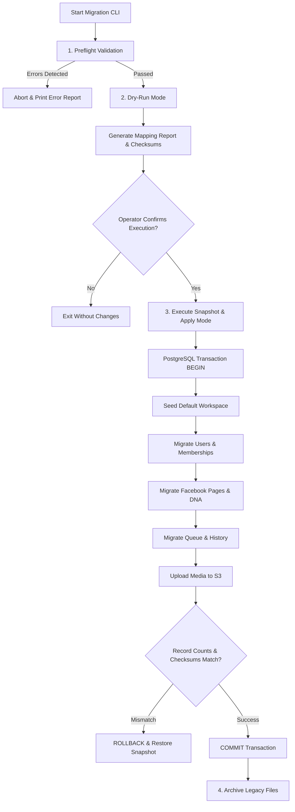

# SaaS Migration Plan and Legacy Data Transition

## 1. Executive Summary

This document specifies the migration strategy from the single-tenant file-based architecture to the multi-tenant PostgreSQL, Redis, and Object Storage SaaS architecture. It provides an exhaustive audit of legacy storage, defines a two-phase CLI migration runner, details legacy workspace seeding, establishes the PR review sequence, and evaluates the SaaS architectural impact on Page DNA (PR #2).

```
+-----------------------------------------------------------------------------+
|                              Migration Status                               |
+--------------------------+--------------------------------------------------+
| CURRENT (Single-Tenant)  | Flat JSON files in data/, local files in uploads/|
|                          | Unused SQLite in services/db.js                  |
+--------------------------+--------------------------------------------------+
| TARGET (Multi-Tenant)    | PostgreSQL 16 (Relational/ACID), Redis HA        |
|                          | (Queues & Sessions), S3 (Media), Zero JSON data  |
+--------------------------+--------------------------------------------------+
| DEFERRED                 | Live zero-downtime dual-write replication        |
+--------------------------+--------------------------------------------------+
```

---

## 2. Legacy Single-Tenant Data Audit (Base Verification)

An exhaustive audit of the base branch (`fix/security-and-content-safety`) reveals the exact legacy storage implementation:

| Storage Artifact | Format & Location | Codebase Evidence & Structure | SaaS Target Entity |
| :--- | :--- | :--- | :--- |
| **User Store** | `data/users.json` | Array of `{ id, username, passwordHash, salt, role, createdAt }`. Hashed via `crypto.pbkdf2Sync` (100k iterations, HMAC-SHA512) in `middleware/auth.js`. | `users` + `workspace_members` (migrated with `pbkdf2_sha512` prefix; auto-rehashed to Argon2id on login) |
| **Settings Store** | `data/settings.json` | Global object containing `pages` array (`[{ id, name, accessToken, systemPrompt, ... }]`) and `activePageId`. Managed by `services/storage.js`. | `facebook_pages` + `workspace_settings` |
| **Queue Store** | `data/queue.json` | Array of scheduled post objects processed by `setInterval` in `services/scheduler.js`. | `content_posts` + `scheduled_posts` |
| **History Store** | `data/history.json` | Array of published post logs with `fbUrl` and `publishedAt`. | `content_posts` + `published_posts` |
| **Template Store**| `data/templates.json` | Pre-configured post formatting templates. | Seeded system templates / workspace templates |
| **Rules & Categories** | `data/automation_rules.json`, `data/categories.json` | Static automation schedules and post categories. | Seed data / relational lookup tables |
| **Page Profile** | `data/profile.json` (PR #2) | Single Page DNA object `{ brandName, tone, primaryGoal, audience, ... }` in PR #2. | `page_dna_profiles` |
| **Profile Backups** | `data/profile-backups/*.json` (PR #2) | Plaintext JSON timestamped snapshots. | `page_dna_versions` (in PostgreSQL) |
| **Media Assets** | `uploads/*` | Local disk files (JPEG, PNG). | Private S3 Bucket + `media_assets` |
| **Abandoned DB** | `services/db.js` (`data/saas.db`) | Unused, unimported SQLite database schema. | **Discard / Do Not Migrate** |

### Abandoned Database Notice (`services/db.js`)
Inspection of `services/db.js` shows a SQLite schema creating `data/saas.db`. However, this file is **completely unused and unimported** across all routes and services. The running application relies exclusively on `services/storage.js` and flat JSON files. The abandoned SQLite file must be discarded during migration.

---

## 3. Migration Principles & Operator Controls

1. **No Automatic Migration on Boot**: The application server must **never** run automated migrations on boot.
2. **Explicit Operator Execution**: Migration is executed exclusively via CLI by an authorized operator:
   `node scripts/migrate-to-saas.js --dry-run`
3. **Mandatory Preflight Validation**: Aborts immediately if database connectivity fails or file checksums do not match.
4. **All Operations Transactional**: All inserts execute within a single PostgreSQL transaction (`BEGIN ... COMMIT`).
5. **Secret Redaction**: Migration logs redact all tokens, passwords, and API keys.

---

## 4. The Two-Phase Migration Runner CLI



### Mode 1: Preflight Validation
- Validates PostgreSQL connectivity, schema migrations, and KMS reachability.
- Parses all JSON files in `data/` and verifies readability of `uploads/`.

### Mode 2: Dry-Run Mode (`--dry-run`)
- Executes in-memory mapping without database writes.
- Produces a **Migration Mapping Report**:
  - Legacy user count and mapped IDs.
  - Legacy post ID -> Target UUID mappings.
  - File size and count of media assets to migrate to S3.

### Mode 3: Apply Mode (`--apply`)
- Creates a timestamped tarball backup (`backup_pre_saas_<timestamp>.tar.gz`) with SHA-256 manifest.
- Opens a PostgreSQL transaction.
- Seeds the initial Default Legacy Workspace (see Section 5).
- Inserts mapped entities.
- Uploads local media files to S3 bucket under `workspaces/{workspace_id}/...`.
- Verifies record counts against preflight manifest.
- Commits transaction.

### Mode 4: Rollback Mode (`--rollback`)
- Truncates newly populated tables for the legacy workspace.
- Restores flat files from the pre-migration snapshot tarball.

---

## 5. Legacy Single-Tenant Workspace Seeding

Because legacy data lacks tenant scoping, all assets are mapped into **one canonical default workspace**:

```mermaid
flowchart LR
    subgraph Legacy [Legacy Data]
        LU[data/users.json: admin]
        LS[data/settings.json]
        LQ[data/queue.json]
        LH[data/history.json]
        LP[data/profile.json]
    end

    subgraph Target [PostgreSQL Entities]
        WS[(Default Workspace: "Legacy Workspace")]
        TU[(User: admin - Role: OWNER)]
        TP[(Facebook Page: Linked to WS)]
        TD[(Page DNA Profile: Linked to Page)]
        TC[(Content Posts & Scheduled Posts)]
    end

    LU --> TU
    TU -->|Owner of| WS
    LS --> TP
    TP -->|Belongs to| WS
    LP --> TD
    TD -->|Belongs to| TP
    LQ --> TC
    LH --> TC
    TC -->|Belongs to| WS
```

### Seeding Rules
1. **Workspace Entity**:
   - Name: `"Primary Workspace"`.
   - Plan Tier: Assigned `pro` with 30-day evaluation period.
2. **User & Membership**:
   - Legacy `admin` user migrated to `users` with `pbkdf2_sha512` prefix.
   - Inserted into `workspace_members` with `role = 'owner'`.
   - Secondary users mapped to `role = 'editor'`.
3. **Facebook Pages & Tokens**:
   - `pages` array from `settings.json` mapped to `facebook_pages`.
   - Tokens encrypted via AES-256-GCM + KMS.
4. **Page DNA Profile**:
   - `data/profile.json` migrated to `page_dna_profiles`.
   - Plaintext profile backups migrated into `page_dna_versions`.

---

## 6. PR Review Statuses and Implementation Sequence

To ensure rigorous quality control, PRs must transition through formal statuses:
- `Draft`
- `Reviewed`
- `Staging validated`
- `Approved for merge`
- `Merged`

### Correct Implementation Order
1. **Step 1: Human review PR #1** (`fix/security-and-content-safety`).
2. **Step 2: Staging validation of PR #1**.
3. **Step 3: Approve and merge PR #1**.
4. **Step 4: Review and merge architecture documentation** (`docs/saas-architecture` -> PR #3).
5. **Step 5: Implement tenancy and PostgreSQL foundation** (`feat/saas-postgres-storage`).
6. **Step 6: Implement persistent sessions** (`feat/saas-persistent-sessions`).
7. **Step 7: Implement Facebook OAuth and encrypted tokens** (`feat/facebook-oauth`).
8. **Step 8: Port Page DNA into tenant-aware repositories** (`feat/page-dna-saas-integration`).
9. **Step 9: Implement durable scheduling and worker** (`feat/durable-scheduling`).
10. **Step 10: Implement billing and entitlements** (`feat/subscriptions`).
11. **Step 11: Migrate legacy data** via CLI runner.
12. **Step 12: Production readiness gate evaluation**.

---

## 7. Page DNA (PR #2) SaaS Integration Strategy

### Recommendation: Cherry-Pick & Adapt into New Branch
- **Strategy**: Keep PR #2 (`feat/page-dna`) as an immutable reference implementation.
- **Rationale**: Direct rebasing would cause massive merge conflicts with the new PostgreSQL repository layer. PR #2's domain models (Bengali enums, validation rules, preset templates) should be cherry-picked into `feat/page-dna-saas-integration` and rewired to the `page_dna_profiles` and `page_dna_versions` tables.
