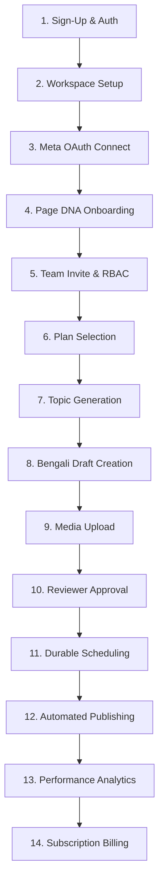

# SaaS Product Scope and Capability Matrix

## 1. Product Vision

The SaaS is an AI-powered, Bengali-first social media content creation, scheduling, approval, and publishing platform tailored for Bengali creators, coaching centres, restaurants, boutiques, local retail businesses, and small digital marketing agencies across West Bengal and the broader Bengali-speaking diaspora.

```
+-----------------------------------------------------------------------------+
|                             Product Scope                                   |
+--------------------------+--------------------------------------------------+
| CURRENT (Single-Tenant)  | Internal single-operator script, manual tokens,  |
|                          | global settings, unmetered usage                 |
+--------------------------+--------------------------------------------------+
| TARGET (Multi-Tenant)    | Multi-tenant workspaces, canonical 5-role RBAC,  |
|                          | Meta OAuth 2.0 connection, Page DNA personas,    |
|                          | durable BullMQ scheduling, India-first billing   |
+--------------------------+--------------------------------------------------+
| DEFERRED                 | Instagram Reels, Facebook Groups, Enterprise SSO |
+--------------------------+--------------------------------------------------+
```

---

## 2. Target Personas

1. **Subhojit (Coaching Centre Director, Siliguri)**: Runs Madhyamik and Higher Secondary preparation batches. Needs high-trust, educational posts in formal, motivational Bengali to attract parent inquiries without hiring an agency.
2. **Tanima (Boutique & Handloom Owner, Kolkata)**: Manages a saree and ethnic boutique. Needs engaging, aesthetic lifestyle posts with festive greetings and product showcases in conversational, relatable Bengali.
3. **Arif (Independent Digital Marketing Consultant, Howrah)**: Manages Facebook pages for 5 local restaurant clients. Needs isolated workspaces per client, distinct Page DNA tone profiles, and an approval workflow for client reviews.
4. **Debanjan (Solo Tech Creator & Reviewer)**: Publishes daily tech explainers. Needs structured topical hooks and rapid drafts with automated scheduling.

---

## 3. The 14-Step Target MVP User Journey



1. **User Sign-Up**: Registers with email and password. Passwords stored using versioned hashes (Argon2id target; legacy PBKDF2 auto-rehashed on login).
2. **Workspace Creation**: Creates initial tenant workspace with isolated data boundaries.
3. **Facebook Page Connection**: Connects Facebook Page via Meta OAuth 2.0 with privacy-safe 1:1 ownership checks.
4. **Page DNA Profile Setup**: Configures brand niche, Bengali tone, audience level, and content safety presets.
5. **Team Collaboration**: Invites team members with canonical roles (`owner`, `admin`, `editor`, `reviewer`, `viewer`).
6. **Plan Subscription**: Selects plan tier via proposed India-first billing (Razorpay recurring mandates).
7. **AI Topic Brainstorming**: Explores trending Bengali topics across categorized niches.
8. **Draft Generation**: Creates structured posts with Bengali hooks, body copy, and hashtags.
9. **Media Asset Handling**: Uploads local imagery to private S3 storage with pre-signed previews.
10. **Reviewer Approval Workflow**: Editor submits draft for review; Reviewer approves or requests revisions.
11. **Durable Scheduling**: Posts queued in PostgreSQL and dispatched to Redis BullMQ.
12. **Safe Automated Publishing**: Worker publishes to Facebook with rate-limit throttling and duplicate prevention.
13. **Engagement Telemetry**: Tracks post impressions and engagement metrics without blocking publish queues.
14. **Billing & Entitlements**: Server-side entitlement middleware meters generation and queue quotas.

---

## 4. Capability Matrix: CURRENT vs TARGET vs DEFERRED

| Feature Area | Current Single-Tenant Implementation | Target Multi-Tenant MVP Specification | Deferred Scale-Up Features |
| :--- | :--- | :--- | :--- |
| **Tenancy** | Single operator; global JSON files in `data/`. | Logical row-level multitenancy in PostgreSQL 16 with composite foreign keys. | Dedicated tenant databases; Citus clustering. |
| **Authentication** | In-memory `Map` in `middleware/auth.js`; PBKDF2-HMAC-SHA512. | Redis opaque bearer sessions; SHA-256 hash lookup; Argon2id with login auto-rehash. | SAML 2.0 / Enterprise SSO; WebAuthn. |
| **Authorization** | Single admin role; no workspace concept. | Canonical 5-role RBAC (`owner`, `admin`, `editor`, `reviewer`, `viewer`); request-scoped context. | Custom dynamic permission definitions. |
| **Facebook Connect** | Manual page ID and token pasted in settings. | Automated Meta OAuth 2.0 flow; server-side state hash; 1:1 page ownership. | Multi-workspace shared page management. |
| **Page DNA** | Global profile in PR #2; flat JSON file. | Multi-tenant profiles scoped to `(workspace_id, facebook_page_id)`. | Multi-language auto-translation. |
| **Queue & Worker** | In-process `node-cron` & `setInterval` in `services/scheduler.js`. | PostgreSQL idempotency boundary + BullMQ Redis worker service with Redlock. | Dedicated multi-fleet worker autoscaling. |
| **Secrets** | Plaintext in settings JSON and environment variables. | Two-tier envelope encryption (AES-256-GCM + KMS); safe telemetry redaction. | Automated dynamic token re-encryption fleets. |
| **Billing** | Completely unmetered; no payment gateway. | Proposed Razorpay India-First billing (INR); server entitlement middleware. | Global multi-currency billing via Stripe. |
| **Media Assets** | Saved to local `uploads/` directory on server disk. | Private S3 object storage; 15-minute pre-signed URLs. | Real-time AI video rendering. |

---

## 5. Explicitly Out-of-Scope Capabilities (MVP Boundaries)

1. **Instagram Graph API Publishing**: Deferred to post-launch.
2. **Facebook Groups Publishing**: Meta API restrictions make Group automated publishing complex for SaaS; deferred.
3. **Direct User-to-User Chat / Direct Messages**: No customer support inbox within the platform.
4. **Third-Party App Marketplace**: No public developer API or plugin store during MVP.
