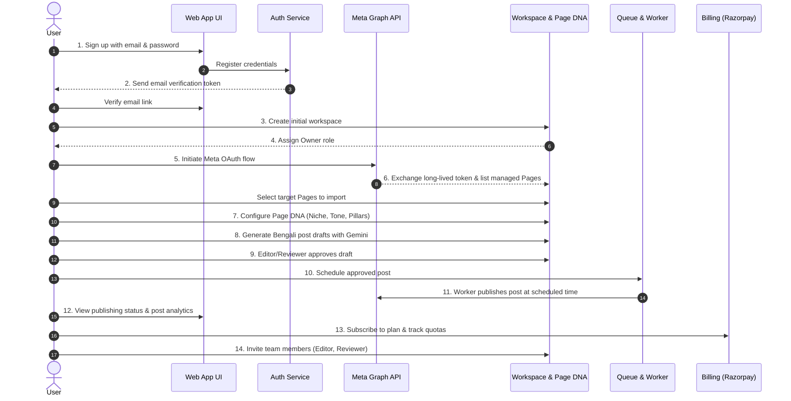

# SaaS Product Scope & MVP Customer Journey

## 1. Product Vision & Market Focus

**AutoPost Bengali SaaS** is a specialized, multi-tenant Facebook automation platform designed specifically for the Bengali-speaking digital ecosystem. The platform bridges the gap between high-level generative AI and authentic, culturally grounded regional social media management.

### Target Market
- **Regional Content Creators:** Authors, bloggers, and cultural educators publishing in Bengali.
- **Educational Institutes & Coaching Centres:** WBCS, WBPSC, SSC, Railway, and Police exam preparation institutions requiring consistent, verified study materials and notifications.
- **Local Boutiques & Artisans:** Bengal handloom, Jamdani, jewelry, and ethnic fashion businesses.
- **Food & Hospitality:** Restaurants, cafes, and cloud kitchens promoting authentic Bengali cuisine and festive offers.
- **Boutique Digital Agencies:** Small marketing agencies managing 5–20 Facebook Pages for local regional businesses in West Bengal, Tripura, and the wider Bengali diaspora.

### Current Status Declaration
> **IMPORTANT ARCHITECTURAL NOTICE:**
> The existing application codebase is an operator-oriented, single-tenant tool storing data in local JSON flat files with in-memory sessions and process-bound scheduler loops. It is **NOT production-ready for SaaS**. This document defines the target production boundaries and migration path required before public multi-tenant onboarding can be enabled.

---

## 2. Capability Classification

To prevent scope creep and maintain architectural discipline, all product capabilities are partitioned into three distinct classifications:

```
┌───────────────────────────────────────────────────────────────────────────┐
│                           CAPABILITY HORIZONS                             │
├─────────────────────────┬─────────────────────────┬───────────────────────┤
│ CURRENT (Single-Tenant) │ TARGET (SaaS MVP)       │ DEFERRED (Post-MVP)   │
│ - Single flat settings  │ - Multi-tenant workspace│ - Omnichannel publish │
│ - In-memory sessions    │ - Redis opaque sessions │ - Full social inbox   │
│ - Local JSON files      │ - PostgreSQL storage    │ - Autonomous bots     │
│ - Global in-process cron│ - BullMQ queue workers  │ - White-label CNAME   │
│ - Unencrypted tokens    │ - KMS envelope crypt    │ - Multi-region        │
└─────────────────────────┴─────────────────────────┴───────────────────────┘
```

---

## 3. End-to-End MVP Customer Journey

The Minimum Viable Product (MVP) covers a complete 14-step self-serve customer lifecycle:



### Detailed Customer Journey Steps

1. **User Sign-Up:** Prospective user registers via email/password. Password strength checked; salted PBKDF2/Argon2id hash stored.
2. **Email Verification:** User receives a signed, time-limited verification token. Account remains in `unverified` state until verified.
3. **Workspace Creation:** Upon first login, user is prompted to create an organization workspace (e.g., "Pariksha Prep Academy" or "Kolkata Saree House").
4. **Ownership Assignment:** System assigns user the `owner` role for that workspace and binds the active session to this newly provisioned workspace context.
5. **Meta OAuth Connection:** User clicks "Connect Facebook". App redirects to Facebook Dialog with explicit OAuth permissions (`pages_show_list`, `pages_read_engagement`, `pages_manage_posts`).
6. **Managed Page Selection:** Backend exchanges authorization code for a long-lived user token, queries `/me/accounts`, and presents a checklist of accessible Pages. User chooses which Pages to attach to the workspace.
7. **Page DNA Configuration:** User defines editorial persona: Bengali language style (Cholit/Sadhu), primary goal, audience knowledge level, content pillars with weights summing to 100%, and approval mode.
8. **Draft Content Generation:** User generates posts using the Page DNA prompt hierarchy. AI incorporates safety guardrails, fact packs, and anti-slop guidelines.
9. **Editorial Review & Approval:** Depending on the configured `approvalMode`, generated posts are held for reviewer sign-off or queued directly if low-risk.
10. **Post Scheduling:** Operator assigns a future publishing timestamp or relies on the workspace's automated slot cadence.
11. **Asynchronous Worker Publishing:** A dedicated background worker locks the scheduled job via Redlock, checks tenant entitlements, decrypts the Page access token, uploads media, and publishes via Meta Graph API.
12. **Status & Analytics:** Dashboard reflects published status, permalink, error diagnostics (if failed), and historical publishing volume.
13. **Subscription & Usage Management:** Workspace owner views current usage against tier quotas (connected pages, posts published, generation credits) and upgrades via Razorpay.
14. **Team Collaboration:** Owner invites colleagues via email with specific roles (`admin`, `editor`, `reviewer`, `viewer`).

---

## 4. Explicitly Out of Scope for MVP

The following features are intentionally excluded from MVP to prevent delivery risks and maintain strict security isolation:

| Excluded Capability | Rationale for Exclusion | Deferred Target Phase |
| :--- | :--- | :--- |
| **Omnichannel Publishing** (Instagram, LinkedIn, X, Threads) | MVP focuses exclusively on Facebook Pages to master Bengali engagement and Meta Graph API edge cases. | Phase 5 |
| **Full Social Inbox & Unified Messaging** | Managing two-way conversational streams requires high-throughput WebSocket infrastructure and 24/7 moderation. | Phase 6 |
| **Automated Comment & Messenger Bots** | Autonomous reply bots present high risk of prompt injection, brand hallucination, and Meta policy violations. | Phase 6 |
| **Autonomous Breaking-News Publishing** | Unverified news auto-publishing introduces legal liability and misinformation risks. All news/announcements require human review in MVP. | Phase 5 |
| **White-Label Agency Portals (CNAME / Custom Domains)** | Requires complex TLS termination, dynamic ingress routing, and dedicated tenancy tiers. | Phase 7 |
| **Advanced Semantic / Vector Analytics** | Basic engagement metrics (reach, reactions, shares, comments) suffice for MVP. ML sentiment clusters deferred. | Phase 5 |
| **Multiple Billing Gateways at Launch** | Launching with Razorpay only for India/INR market. Multi-gateway routing adds unnecessary abstraction. | Phase 4 |
| **Multi-Region Active-Active Database Deployment** | Initial launch is single-region (ap-south-1 Mumbai) with hot read-replicas. | Phase 7 |

---

## 5. Target User Personas

### Persona A: The Exam Coaching Centre Director
- **Profile:** Subhashis, runs a coaching centre in Bardhaman for WBCS & Rail exams.
- **Pain Point:** Inability to produce consistent, error-free study notes, exam alerts, and daily quizzes in Bengali every day at 9 AM, 2 PM, and 8 PM.
- **SaaS Benefit:** Configures Exam Page DNA, seeds syllabus topics, and relies on scheduled auto-generation with manual approval for notices.

### Persona B: The Boutique Saree Brand Owner
- **Profile:** Ananya, owns a boutique in Gariahat, Kolkata selling Dhaniakhali and Baluchari sarees.
- **Pain Point:** Needs artistic, poetic, yet professional Bengali captions describing weaves, heritage, and pricing without sounding like generic translated text.
- **SaaS Benefit:** Boutique preset with inspirational tone, 35% styling tips, 40% heritage stories, 25% direct inquiries.

### Persona C: The Boutique Digital Marketing Agency
- **Profile:** Amit, operates a 4-person agency in Salt Lake managing 12 local business Facebook pages.
- **Pain Point:** Logging in and out of different client accounts; risk of posting a restaurant update to a hospital page; keeping client access tokens safe.
- **SaaS Benefit:** Multi-tenant workspace architecture allowing role separation, distinct Page DNA profiles per client Page, and team review workflows.
