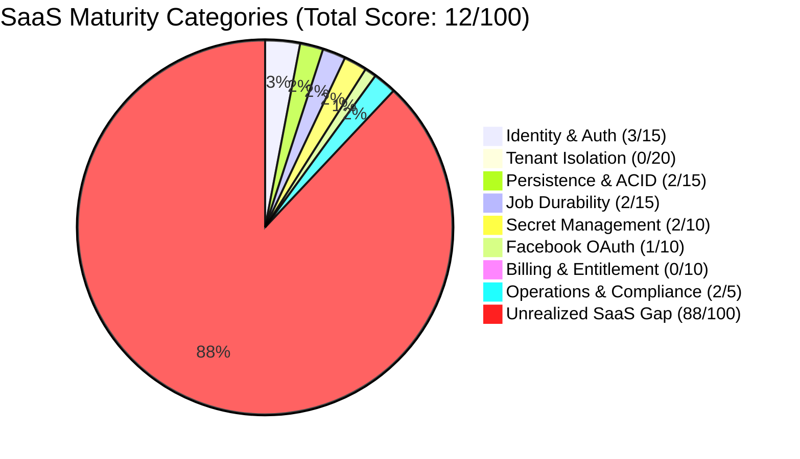
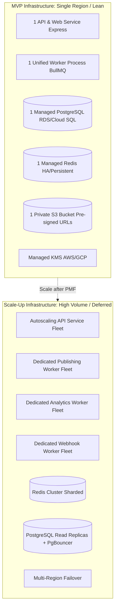
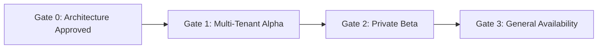
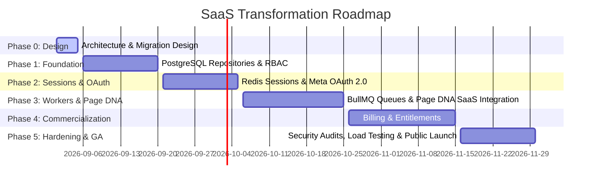

# Production Readiness and SaaS Maturity Assessment

## 1. Executive Summary

This document provides the definitive production readiness evaluation, maturity scorecard, critical blocker matrix, gate criteria, and phased rollout roadmap for transforming the Bengali-first Facebook Auto-Poster into a commercial multi-tenant SaaS.

```
+-----------------------------------------------------------------------------+
|                           SaaS Readiness Score                              |
+-----------------------------------------------------------------------------+
| Overall Production SaaS Readiness: 12 / 100                                |
| Status: PRE-ALPHA / SINGLE-TENANT OPERATOR TOOL (NOT SAAS READY)            |
+-----------------------------------------------------------------------------+
```

---

## 2. Transparent 100-Point SaaS Readiness Rubric (12/100)

The application currently operates as an internal single-operator automation tool. The scorecard evaluates the codebase across 8 essential SaaS production categories totaling exactly 100 points:



### Detailed Category Breakdown

| Category | Current Score | Max Score | Codebase Evidence | Requirement for Full Score |
| :--- | :---: | :---: | :--- | :--- |
| **1. Tenant Isolation** | **0** | **20** | All state resides in shared JSON files (`data/settings.json`, `data/queue.json`). Requests execute with zero tenant scoping or organization boundaries. | Strict composite row-level tenant scoping (`workspace_id`), PostgreSQL Row-Level Security (RLS), anti-IDOR tests, zero cross-tenant leakage. |
| **2. Identity & Authorization** | **3** | **15** | Password authentication via PBKDF2-HMAC-SHA512 exists in `middleware/auth.js`. However, sessions are volatile in-memory JavaScript `Map` objects in `middleware/auth.js`, no RBAC roles exist, and there is no active workspace context. | Redis-backed opaque bearer sessions, canonical 5-role RBAC (`owner`, `admin`, `editor`, `reviewer`, `viewer`), multi-device revocation tracking, Argon2id password hashing. |
| **3. Persistence & Data Integrity** | **2** | **15** | Flat JSON files written synchronously via `services/storage.js`. Concurrent requests risk race conditions and corruption. `services/db.js` defines an unused SQLite schema (`saas.db`) that is completely unimported. | Production PostgreSQL 16 relational storage, ACID transactions, foreign keys, schema migrations, and point-in-time recovery. |
| **4. Job Durability** | **2** | **15** | `services/scheduler.js` uses in-process `node-cron` and `setInterval`. Jobs are lost on server crash or restart. No distributed locks, no retry backoff, and no dead-letter queue. | BullMQ queue backed by Redis, PostgreSQL database idempotency boundary, Redlock concurrency optimization, rate-limit backoff, graceful shutdown. |
| **5. Secret Management** | **2** | **10** | Error sanitization and content safety guards exist in PR #1. However, Facebook tokens and API keys are stored plaintext in `data/settings.json` and environment variables. | Envelope encryption (AES-256-GCM + KMS), zero plaintext tokens in database or environment, automated key rotation, safe structured logging. |
| **6. Facebook OAuth Readiness** | **1** | **10** | Basic Graph API token verification exists in `services/facebook.js`. However, tokens must be manually pasted; no automated OAuth 2.0 authorization code flow, webhook routing, or data deletion callback exists. | Meta OAuth 2.0 Authorization Code flow with server-side one-time hash state, strict 1:1 page ownership conflict resolution, webhook tenant routing, data deletion compliance. |
| **7. Billing & Entitlement** | **0** | **10** | Zero billing code, no subscription management, no usage metering, no payment gateway webhooks. | India-first Razorpay subscription integration (or validated provider), server-side entitlement middleware enforcing plan quotas, idempotent webhook processing. |
| **8. Operations & Compliance** | **2** | **5** | PR #1 adds request origin validation, CSRF checks, and content safety filters. However, no structured audit log table exists and uploads reside on local disk. | Private S3 object storage for media with pre-signed URLs, immutable audit logs table with user attribution, structured safe publish attempt logging. |
| **TOTAL** | **12** | **100** | **Pre-Alpha single-operator foundation** | **Commercial multi-tenant SaaS readiness** |

---

## 3. Right-Sized Infrastructure Architecture

To avoid premature optimization and unnecessary operational overhead, the infrastructure is strictly divided into MVP Launch versus Scale-Up phases:



### MVP Infrastructure Specification (Launch)
- **Database**: 1 Managed PostgreSQL 16 instance (db.t4g.medium or equivalent) with automated daily backups.
- **Cache & Queues**: 1 Managed Redis instance with persistence (AOF/RDB) and high availability.
- **Compute**:
  - 1 API Service (containerized Node.js Express web application).
  - 1 Worker Service (single BullMQ consumer process running publishing, scheduling, and webhook jobs).
- **Storage**: 1 Private S3-compatible bucket for media assets, accessed via short-lived (15-minute) pre-signed URLs.
- **Security**: 1 Managed KMS service (AWS KMS or GCP Cloud KMS) for master key envelope encryption.

### Scale-Up Infrastructure Specification (Deferred)
- **Redis Cluster**: Sharded multi-node Redis cluster for high-throughput queues.
- **Worker Fleet Decomposition**: Dedicated publishing, analytics, and webhook worker pools autoscaled on queue depth.
- **Database Read Replicas**: Connection pooling via PgBouncer and read replicas for heavy analytics queries.
- **Multi-Region Deployment**: Cross-region disaster recovery.

---

## 4. Critical Production Blockers Matrix

Before accepting paid customers or public registrations, the following critical blockers must be resolved in order of severity:

### Priority 0: Fatal Security & Architectural Blockers (Must Resolve Before Alpha)
- **BLK-P0-01: Global State & Lack of Workspace Isolation**: Current routes execute without tenant boundaries. Concurrent users overwrite each other's settings and queue.
- **BLK-P0-02: Plaintext Access Tokens in Settings & Env**: Facebook Page tokens exist unencrypted in `data/settings.json` and environment variables.
- **BLK-P0-03: In-Memory Volatile Sessions**: Node process restarts invalidate all active user logins in `middleware/auth.js`.
- **BLK-P0-04: Non-Durable In-Memory Scheduler**: Scheduled posts rely on in-process `node-cron` and `setInterval`. Server crashes cause silent post drops.
- **BLK-P0-05: Missing Facebook OAuth 2.0 Flow**: Users cannot connect their own Facebook Pages dynamically.

### Priority 1: High Operational & Financial Blockers (Must Resolve Before Beta)
- **BLK-P1-01: Flat-File JSON Concurrency Bottlenecks**: Concurrent writes to `data/queue.json` or `data/profile.json` risk file corruption.
- **BLK-P1-02: Absence of Billing & Entitlement Gates**: Unrestricted content generation will incur unmetered LLM API costs.
- **BLK-P1-03: Unhandled Facebook Rate Limits**: High-volume posting risks application-wide Facebook Graph API bans.
- **BLK-P1-04: Local Disk File Storage**: Uploaded media stored on local filesystem (`uploads/`) is lost upon container redeployment.

### Priority 2: Medium Governance & Reliability Blockers (Must Resolve Before GA)
- **BLK-P2-01: No Fine-Grained RBAC**: Lack of canonical roles (`owner`, `admin`, `editor`, `reviewer`, `viewer`).
- **BLK-P2-02: Missing Multi-Tenant Audit Logging**: No compliance trail for post creations, approvals, or deletions.
- **BLK-P2-03: Single Browser Session Conflict**: No request-level workspace scoping for multi-tab agency workflows.

---

## 5. Production Readiness Gates (Exit Criteria)



### Gate 0: Architecture & Security Baseline (Current Phase)
- [x] Complete multi-tenant architecture specifications (`docs/saas/`).
- [x] Transparent 100-point rubric and audit of legacy implementation.
- [x] PostgreSQL relational schema with UUIDv7 and composite foreign keys designed.
- [x] Redis opaque session and token hashing model finalized.
- [x] Threat models, anti-IDOR authorization, and safe attempt logging specified.
- [x] Migration CLI and legacy workspace seeding designed.

### Gate 1: Multi-Tenant Alpha (Internal Dogfooding)
- [ ] PostgreSQL 16 repositories replace `services/storage.js`.
- [ ] Redis session store replaces in-memory session Map in `middleware/auth.js`.
- [ ] 8-step authorization pipeline enforced on all API endpoints.
- [ ] Envelope encryption (AES-256-GCM + KMS) secures all external tokens.
- [ ] Meta OAuth 2.0 connection and 1:1 page ownership operational.
- [ ] Zero test regressions across unit and integration test suites.

### Gate 2: Private Beta (Invite-Only Bengali Creators & Agencies)
- [ ] BullMQ background worker service with PostgreSQL idempotency boundary.
- [ ] Meta Graph API rate-limit throttling (`X-Page-Usage`) and backoff operational.
- [ ] S3-compatible private object storage for media uploads with pre-signed URLs.
- [ ] Page DNA (PR #2) fully integrated into multi-tenant workspace schema.
- [ ] Automated end-to-end multi-tenant isolation tests passing in CI.

### Gate 3: General Availability (Commercial Public Launch)
- [ ] India-First subscription billing (UPI AutoPay, e-Mandates, GST invoicing validated).
- [ ] Server-side entitlement middleware strictly enforcing plan quotas.
- [ ] Idempotent billing webhook processing with deduplication in PostgreSQL.
- [ ] Meta Data Deletion callback endpoint compliant and verified.
- [ ] Load testing verifying concurrent publishing jobs with zero cross-tenant contamination.

---

## 6. Phased Rollout Roadmap

The implementation roadmap is divided into 6 sequential phases:


