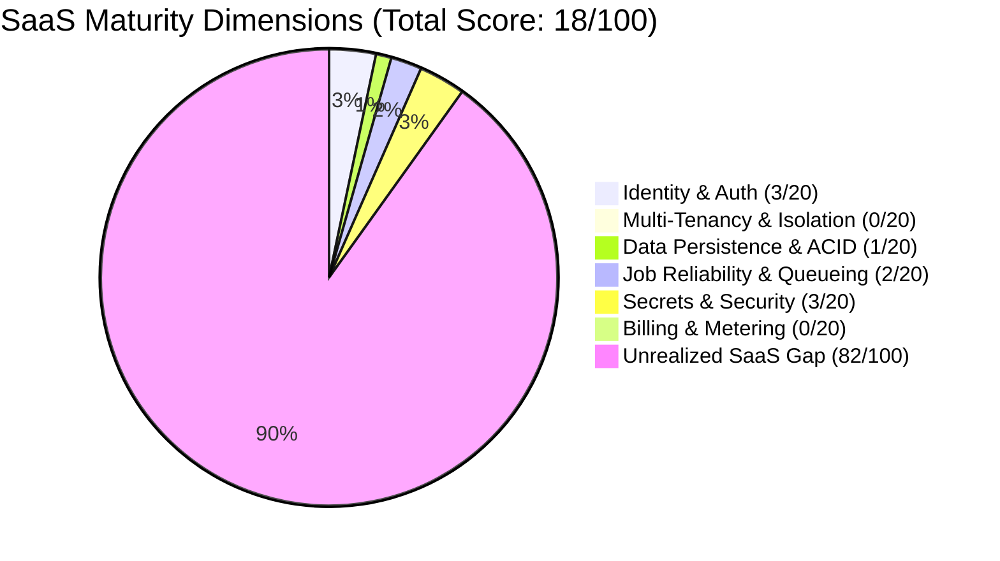
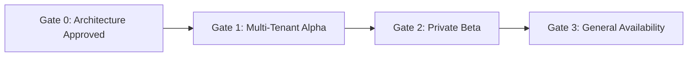
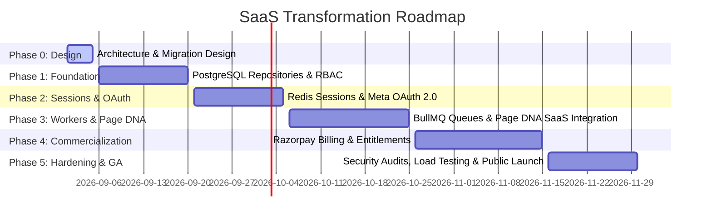

# Production Readiness and SaaS Maturity Assessment

## 1. Executive Summary

This document provides the definitive production readiness evaluation, maturity scorecard, critical blocker matrix, gate criteria, and phased rollout roadmap for transforming the Bengali-first Facebook Auto-Poster into a commercial multi-tenant SaaS.

```
+-----------------------------------------------------------------------------+
|                           SaaS Readiness Score                              |
+-----------------------------------------------------------------------------+
| Overall Production SaaS Readiness: 18 / 100                                |
| Status: PRE-ALPHA / SINGLE-TENANT OPERATOR TOOL (NOT SAAS READY)            |
+-----------------------------------------------------------------------------+
```

---

## 2. Comprehensive SaaS Readiness Scorecard (18/100)

The application currently operates as an internal single-operator automation script. The scorecard evaluates the codebase across 6 essential SaaS production dimensions:



| Dimension | Weight | Current Score | Target Score | Gap Analysis & Rationale |
| :--- | :---: | :---: | :---: | :--- |
| **1. Multi-Tenancy & Isolation** | 20 | **0 / 20** | 20 / 20 | **Zero multi-tenancy**. All data is stored in global JSON files (`data/settings.json`, `data/profile.json`). No tenant identifiers, no workspace scoping, no cross-tenant isolation mechanisms. |
| **2. Identity & Access Management** | 20 | **3 / 20** | 20 / 20 | Basic password hashing (argon2id) and simple file user store exist. However, sessions are in-memory JavaScript Maps, there is no RBAC, no active workspace context, no OAuth 2.0, and no multi-device tracking. |
| **3. Data Persistence & Integrity** | 20 | **1 / 20** | 20 / 20 | Flat JSON files lack ACID transactions, foreign keys, and point-in-time recovery. Prone to file-write race conditions and data corruption during concurrent requests. `services/db.js` SQLite is abandoned. |
| **4. Job Scheduling & Reliability** | 20 | **2 / 20** | 20 / 20 | Uses Node.js `setTimeout` and in-memory timers. If the server restarts or crashes, scheduled posts are lost or delayed. No distributed locks, no retry backoff, no DLQ, no rate-limit monitoring. |
| **5. Secrets & Security Architecture** | 20 | **3 / 20** | 20 / 20 | Input validation and content safety filters are implemented in PR #1 / PR #2. However, Facebook tokens and credentials are stored in plaintext environment variables without envelope encryption or KMS. |
| **6. Billing, Metering & Entitlements**| 20 | **0 / 20** | 20 / 20 | **Zero billing infrastructure**. No subscription management, no usage tracking, no quota enforcement, no payment gateway integration. |
| **TOTAL SCORE** | **100** | **18 / 100** | **100 / 100** | **Architectural Foundation Required Before Implementation.** |

---

## 3. Critical Production Blockers Matrix

Before accepting paid customers or public registrations, the following critical blockers must be resolved in order of severity:

### Priority 0: Fatal Security & Architectural Blockers (Must Resolve Before Alpha)
- **BLK-P0-01: Global State & Lack of Workspace Isolation**: Current routes execute without tenant boundaries. Two concurrent users would overwrite each other's settings, drafts, and profiles.
- **BLK-P0-02: Plaintext Access Tokens in Environment**: Facebook Page tokens and App secrets exist as global env variables. A single leak compromises all connected pages.
- **BLK-P0-03: In-Memory Volatile Sessions**: Node process restarts invalidate all active user logins, interrupting user workflows and API operations.
- **BLK-P0-04: Non-Durable In-Memory Timers**: Scheduled posts rely on in-memory timers (`setTimeout`). Server crashes lead to silent post failures.
- **BLK-P0-05: Missing Facebook OAuth 2.0 Flow**: Users cannot connect their own Facebook Pages; the system only supports manually pasted tokens.

### Priority 1: High Operational & Financial Blockers (Must Resolve Before Beta)
- **BLK-P1-01: Flat-File JSON Concurrency Bottlenecks**: Concurrent writes to `data/queue.json` or `data/profile.json` risk file corruption.
- **BLK-P1-02: Absence of Billing & Entitlement Gates**: Unrestricted content generation could result in unmetered OpenAI / AI provider costs.
- **BLK-P1-03: Unhandled Facebook Rate Limits**: High-volume posting risks application-wide Facebook Graph API bans without backoff controls.
- **BLK-P1-04: Local Disk File Storage**: Uploaded media stored on local filesystem (`uploads/`) will be lost upon container redeployment.

### Priority 2: Medium Experience & Governance Blockers (Must Resolve Before GA)
- **BLK-P2-01: No Fine-Grained RBAC**: Editors can perform administrative actions like deleting profiles or disconnecting pages.
- **BLK-P2-02: Missing Multi-Tenant Audit Logging**: No compliance trail for post creations, approvals, or deletions.
- **BLK-P2-03: Single Browser Session Conflict**: No header-based workspace scoping for multi-tab agency workflows.

---

## 4. Production Readiness Gates (Exit Criteria)

The product may only advance through commercial launch milestones when it satisfies the following verifiable gates:



### Gate 0: Architecture & Security Baseline (Current Phase)
- [x] Complete multi-tenant architecture specifications (`docs/saas/`).
- [x] PostgreSQL relational schema with UUIDv7 and workspace foreign keys designed.
- [x] Redis opaque session and token hashing model finalized.
- [x] Threat models and anti-IDOR authorization pipeline specified.
- [x] Migration CLI and legacy workspace seeding designed.

### Gate 1: Multi-Tenant Alpha (Internal Dogfooding)
- [ ] PostgreSQL 16 repositories replace `services/storage.js`.
- [ ] Redis session cluster replaces in-memory session Map.
- [ ] 8-step authorization pipeline enforced on all API endpoints.
- [ ] Envelope encryption (AES-256-GCM + KMS) secures all external tokens.
- [ ] Meta OAuth 2.0 connection and 1:1 page ownership operational.
- [ ] Zero test regressions across unit and integration test suites.

### Gate 2: Private Beta (Invite-Only Bengali Creators & Agencies)
- [ ] BullMQ background publishing workers with Redlock distributed locking.
- [ ] Meta Graph API rate-limit throttling (`X-Page-Usage`) and backoff operational.
- [ ] S3-compatible private object storage for media uploads with pre-signed URLs.
- [ ] Page DNA (PR #2) fully integrated into multi-tenant workspace schema.
- [ ] Automated end-to-end multi-tenant isolation tests passing in CI.

### Gate 3: General Availability (Commercial Public Launch)
- [ ] Razorpay India-First subscription billing (UPI AutoPay, e-Mandates, GST).
- [ ] Server-side entitlement middleware strictly enforcing plan quotas.
- [ ] Idempotent billing webhook processing with deduplication in PostgreSQL.
- [ ] Meta Data Deletion callback endpoint compliant and verified.
- [ ] Load testing verifying 1,000 concurrent publishing jobs with zero cross-tenant contamination.

---

## 5. Phased Rollout Roadmap

The implementation roadmap is divided into 6 sequential phases:



1. **Phase 0: Multi-Tenant Architecture & Migration Design (Current)**
   - Complete comprehensive system documentation, schemas, threat models, and ADRs.
2. **Phase 1: Identity, Workspaces & PostgreSQL Data Foundation**
   - Provision PostgreSQL 16. Implement schema migrations, users, workspaces, memberships, and repository layer.
3. **Phase 2: Persistent Sessions & Meta OAuth 2.0 Integration**
   - Deploy Redis session store. Implement SHA-256 token hashing, workspace switching, and Meta OAuth 2.0 PKCE flow.
4. **Phase 3: Durable Job Processing & Page DNA SaaS Integration**
   - Deploy BullMQ workers. Port Page DNA algorithms into multi-tenant repositories. Implement Redlock and S3 storage.
5. **Phase 4: Razorpay India-First Billing & Usage Metering**
   - Integrate Razorpay Subscriptions, UPI AutoPay, entitlement middleware, and idempotent webhooks.
6. **Phase 5: Production Hardening & General Availability**
   - Penetration testing, cross-tenant IDOR verification, performance benchmarking, and commercial launch.
