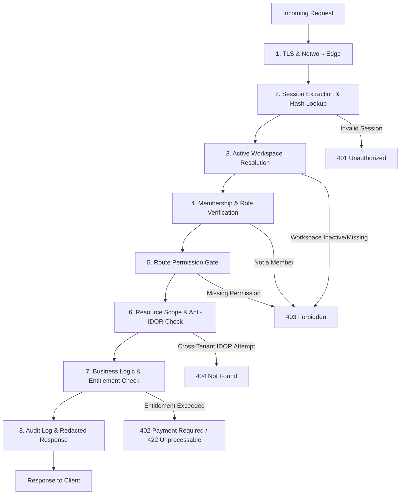
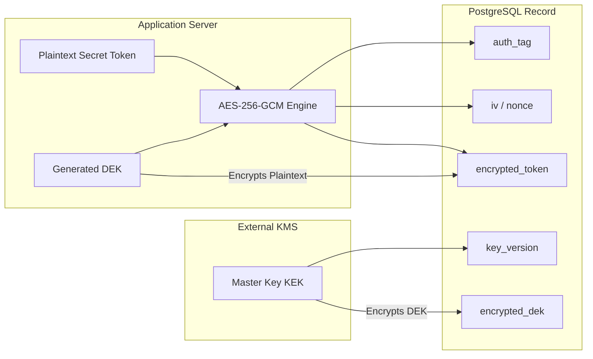

# SaaS Tenant Security and Isolation Model

## 1. Executive Summary

This document specifies the multi-tenant security architecture, authorization pipeline, role-based access control (RBAC) matrix, secrets encryption model, and cross-tenant threat models for the Bengali-first Facebook Auto-Poster SaaS.

In a multi-tenant system serving content creators, local businesses, and digital agencies, tenant isolation is a non-negotiable security boundary. Data leakage between competing businesses (e.g., two coaching centres or two boutique shops in Kolkata) would cause catastrophic reputational and legal liability.

```
+-----------------------------------------------------------------------------+
|                               Security Status                               |
+--------------------------+--------------------------------------------------+
| CURRENT (Single-Tenant)  | In-memory sessions, no workspace isolation,     |
|                          | global JSON files, plain-text env credentials    |
+--------------------------+--------------------------------------------------+
| TARGET (Multi-Tenant)    | Strict workspace scoping on all DB queries,      |
|                          | Redis opaque sessions, 8-step authorization      |
|                          | pipeline, envelope encryption (AES-256-GCM + KMS)|
+--------------------------+--------------------------------------------------+
| DEFERRED                 | Agency cross-workspace delegated access, SSO/SAML|
+--------------------------+--------------------------------------------------+
```

---

## 2. Eight-Step Request Authorization Pipeline

Every incoming HTTP request to protected API routes must traverse an immutable 8-step security pipeline before accessing any tenant resource.



### Pipeline Details

1. **Step 1: TLS Termination & Network Edge**
   - HSTS enabled, TLS 1.3 enforced.
   - Rate limiting per IP and per session hash.

2. **Step 2: Session Token Extraction & SHA-256 Lookup**
   - Opaque bearer token extracted from secure `HttpOnly`, `SameSite=Lax`, `Secure` cookie or `Authorization: Bearer` header.
   - Compute `SHA-256(token)`.
   - Query Redis for session key `session:{sha256}`.
   - If key does not exist or has expired, return `401 Unauthorized`.
   - Update `last_active_at` timestamp (idle timeout extension).

3. **Step 3: Active Workspace Resolution**
   - Active `workspace_id` is loaded from the verified Redis session.
   - **CRITICAL RULE**: The application must **NEVER** trust a `workspace_id` supplied only in a request body, query parameter, or arbitrary client header.
   - If a client requests to switch workspaces via explicit header `X-Workspace-Id`, the server validates that the session user has an active membership in that specific workspace before switching context.

4. **Step 4: Membership & Role Verification**
   - Verify that `(user_id, workspace_id)` exists in PostgreSQL `workspace_members` with `status = 'active'`.
   - If member status is `suspended` or row is absent, immediately terminate authorization and return `403 Forbidden`.
   - Cache active membership in Redis session for up to 60 seconds with instant invalidation via Pub/Sub on membership revocation.

5. **Step 5: Route Permission Gate**
   - Check if member role (`owner`, `admin`, `editor`, `approver`, `viewer`) possesses the required permission string (e.g., `posts:publish`, `settings:manage`) for the endpoint method and path.
   - If insufficient role, return `403 Forbidden`.

6. **Step 6: Resource Scope & Anti-IDOR Check**
   - When accessing a resource by ID (e.g., `GET /api/v1/posts/:id` or `POST /api/v1/pages/:id/sync`):
   - The repository query MUST include both the resource ID and the active `workspace_id`:
     `SELECT * FROM content_posts WHERE id = $1 AND workspace_id = $2;`
   - If the record does not exist OR belongs to another workspace, return `404 Not Found` (never return `403 Forbidden` for IDOR attempts, as `403` confirms resource existence to an attacker).

7. **Step 7: Business Logic & Entitlement Check**
   - Verify plan limits (e.g., monthly post quota, connected page limit) before state mutations.
   - Enforce Page DNA safety policies, validation rules, and approval status checks.

8. **Step 8: Audit Logging & Redacted Response**
   - Record mutating events (CREATE, UPDATE, DELETE, PUBLISH) in `audit_logs`.
   - Strip sensitive fields (access tokens, hashed secrets, internal KMS keys) before JSON serialization.

---

## 3. Role-Based Access Control (RBAC) Matrix

The system defines 5 hierarchical and functional roles within a workspace:
- **Owner**: Workspace creator/billing manager. Full administrative and destructive authority.
- **Admin**: Operations lead. Manages members, connections, profiles, and settings. Cannot delete workspace or transfer ownership.
- **Editor**: Content creator. Drafts posts, uploads media, adjusts post settings. Cannot publish directly if workspace requires approval.
- **Approver**: Quality and compliance reviewer. Can review, reject, approve, and schedule posts.
- **Viewer**: Read-only stakeholder or client. Can view analytics, queue, and content drafts.

### Resource Domains x Role Permissions

| Domain | Permission String | Viewer | Editor | Approver | Admin | Owner |
| :--- | :--- | :---: | :---: | :---: | :---: | :---: |
| **Workspace** | `workspace:read` | Yes | Yes | Yes | Yes | Yes |
| | `workspace:update` | No | No | No | Yes | Yes |
| | `workspace:delete` | No | No | No | No | Yes |
| | `workspace:transfer` | No | No | No | No | Yes |
| **Members** | `members:list` | Yes | Yes | Yes | Yes | Yes |
| | `members:invite` | No | No | No | Yes | Yes |
| | `members:update_role` | No | No | No | Yes | Yes |
| | `members:remove` | No | No | No | Yes | Yes |
| **Billing** | `billing:read` | No | No | No | Yes | Yes |
| | `billing:manage` | No | No | No | No | Yes |
| **Facebook Connections** | `fb_connection:list` | Yes | Yes | Yes | Yes | Yes |
| | `fb_connection:create` | No | No | No | Yes | Yes |
| | `fb_connection:disconnect` | No | No | No | Yes | Yes |
| **Facebook Pages** | `fb_page:read` | Yes | Yes | Yes | Yes | Yes |
| | `fb_page:link` | No | No | No | Yes | Yes |
| | `fb_page:unlink` | No | No | No | Yes | Yes |
| **Page DNA / Profiles** | `page_dna:read` | Yes | Yes | Yes | Yes | Yes |
| | `page_dna:update` | No | No | Yes | Yes | Yes |
| | `page_dna:reset` | No | No | No | Yes | Yes |
| | `page_dna:audit_read` | No | No | No | Yes | Yes |
| **Content Drafts** | `drafts:read` | Yes | Yes | Yes | Yes | Yes |
| | `drafts:create` | No | Yes | Yes | Yes | Yes |
| | `drafts:update` | No | Yes | Yes | Yes | Yes |
| | `drafts:delete` | No | Yes | Yes | Yes | Yes |
| **Post Approvals** | `approvals:read` | Yes | Yes | Yes | Yes | Yes |
| | `approvals:submit` | No | Yes | Yes | Yes | Yes |
| | `approvals:decide` | No | No | Yes | Yes | Yes |
| **Post Scheduling** | `schedule:read` | Yes | Yes | Yes | Yes | Yes |
| | `schedule:create` | No | No | Yes | Yes | Yes |
| | `schedule:update` | No | No | Yes | Yes | Yes |
| | `schedule:cancel` | No | No | Yes | Yes | Yes |
| **Post Publishing** | `publish:manual_trigger`| No | No | Yes | Yes | Yes |
| | `publish:retry` | No | No | No | Yes | Yes |
| **Media Assets** | `media:read` | Yes | Yes | Yes | Yes | Yes |
| | `media:upload` | No | Yes | Yes | Yes | Yes |
| | `media:delete` | No | Yes | Yes | Yes | Yes |
| **Audit Logs** | `audit:read` | No | No | No | Yes | Yes |
| **Webhooks** | `webhooks:read` | No | No | No | Yes | Yes |
| | `webhooks:manage` | No | No | No | Yes | Yes |

---

## 4. Secrets Architecture & Envelope Encryption

### Threat Overview
Storing long-lived Facebook User Access Tokens and Facebook Page Access Tokens in plaintext in the database creates an existential risk: a SQL injection vulnerability or database backup leak would compromise all connected Facebook pages across every tenant.

### Envelope Encryption Design
All sensitive credentials are protected using two-tier envelope encryption:
1. **Master Key (Key Encryption Key - KEK)**:
   - Managed in an external Key Management Service (AWS KMS, Google Cloud KMS, or HashiCorp Vault).
   - NEVER stored in PostgreSQL or committed to source code.
   - Master key is accessible only to production environments via IAM instance profiles.
2. **Data Encryption Key (DEK)**:
   - 256-bit cryptographically secure random key generated per tenant or per secret record.
   - DEK is encrypted using KMS (KEK) and stored alongside the ciphertext as `encrypted_dek`.
   - Alternatively, a KMS-derived Workspace Data Key can be used with a local AES-256-GCM cipher.



### Record-Level Storage Specification
Every table storing secrets (`facebook_connections`, `facebook_pages`, `workspace_ai_keys`) must store:
- `encrypted_token`: Binary or Base64 encoded ciphertext.
- `key_version`: Identifier indicating which KMS key version was used (supports zero-downtime rotation).
- `iv`: 12-byte initialization vector (nonce), randomly generated per encryption operation.
- `auth_tag`: 16-byte authentication tag produced by AES-256-GCM for integrity and tamper-evidence.
- `encrypted_dek`: The encrypted data key if using envelope encryption.

### Key Rotation Procedure
1. Create a new master key version in KMS.
2. Background worker reads encrypted records with `key_version < current_version`.
3. Worker decrypts using old key version, encrypts with new key version, and saves updated record.
4. Old key version is retired only after all records verify under the new key version.

---

## 5. Comprehensive Cross-Tenant Threat Model

The following matrix documents the 15 required cross-tenant threat scenarios, their attack mechanisms, preventative architecture, database constraints, middleware controls, and automated verification tests.

### Threat 1: IDOR Through Page ID
- **Attack**: Tenant B guesses or intercepts Tenant A's internal `facebook_pages.id` (or Facebook Page ID) and attempts `GET /api/v1/pages/:id` or `POST /api/v1/pages/:id/generate`.
- **Prevention**: Enforce composite tenant scoping on every page lookup.
- **Database Constraint**: `UNIQUE (workspace_id, id)` and unique constraint on `facebook_page_id`.
- **Middleware / Query Control**:
  ```sql
  SELECT * FROM facebook_pages
  WHERE id = :page_id AND workspace_id = :active_workspace_id;
  ```
  Return `404 Not Found` if 0 rows returned.
- **Automated Test**: `test_idor_page_lookup_other_tenant_returns_404()`.

### Threat 2: IDOR Through Post or Draft ID
- **Attack**: Tenant B sends `PATCH /api/v1/posts/:postId` with a payload to rewrite Tenant A's scheduled post caption or publish immediately.
- **Prevention**: All content tables (`content_posts`, `post_versions`, `scheduled_posts`) have `workspace_id` indexed and validated.
- **Database Constraint**: Foreign key `FOREIGN KEY (workspace_id) REFERENCES workspaces(id)` on `content_posts`.
- **Middleware / Query Control**: Ensure update queries use `WHERE id = :post_id AND workspace_id = :active_workspace_id`.
- **Automated Test**: `test_cross_tenant_post_update_returns_404()`.

### Threat 3: Workspace ID Body Tampering
- **Attack**: Tenant B is logged into Workspace B, but crafts a `POST /api/v1/posts` request with `\"workspace_id\": \"<workspace-A-uuid>\"` in the JSON body.
- **Prevention**: Completely ignore any client-supplied `workspace_id` in request payloads. The server extracts `workspace_id` strictly from the validated session object.
- **Database Constraint**: Database foreign key cascades enforce parent workspace existence.
- **Middleware / Query Control**: Input validator schema rejects or strips `workspace_id` from incoming request body; service layer injects `session.active_workspace_id`.
- **Automated Test**: `test_ignore_body_workspace_id_tamper()`.

### Threat 4: Changing Active Workspace Without Membership
- **Attack**: User belongs to Workspace A. User crafts request with header `X-Workspace-Id: <workspace-B-uuid>`.
- **Prevention**: Active workspace resolution checks `workspace_members` table for `(user_id, requested_workspace_id, status='active')`.
- **Database Constraint**: `PRIMARY KEY (workspace_id, user_id)` in `workspace_members`.
- **Middleware / Query Control**: Middleware `verifyWorkspaceMembership` executes before route controller. If record absent, returns `403 Forbidden`.
- **Automated Test**: `test_cannot_switch_to_unjoined_workspace()`.

### Threat 5: Cached Data From a Previous Workspace
- **Attack**: User switches from Workspace A to Workspace B in the same browser session. Client SPA or server in-memory cache returns Tenant A's cached Page DNA profile or draft list.
- **Prevention**: Client-side storage (`sessionStorage`, IndexedDB, React state) must namespace all caches by `ws_${workspace_id}`. Server-side caching (Redis) keys must prefix with `ws:${workspace_id}:`.
- **Database Constraint**: N/A (Cache layer constraint).
- **Middleware / Query Control**: Workspace switch invalidates client query cache and sends cache-control headers: `Cache-Control: no-store, private`.
- **Automated Test**: `test_workspace_switch_flushes_and_namespaces_cache()`.

### Threat 6: Webhook Event Assigned to Wrong Tenant
- **Attack**: Meta posts webhook update for a Facebook Page. An attacker sends spoofed webhook payloads or an internal lookup matches page ID improperly across tenants.
- **Prevention**:
  1. Verify `X-Hub-Signature-256` HMAC with Facebook App Secret.
  2. Map `entry[].id` (Facebook Page ID) against `facebook_pages` table where `status = 'active'`.
  3. Resolve the single owning `workspace_id`. If not found, drop event and log security alert.
- **Database Constraint**: `UNIQUE (facebook_page_id)` ensures a Facebook Page ID can NEVER belong to more than one workspace.
- **Middleware / Query Control**: Webhook ingest verifies HMAC signature before payload parsing; tenant resolver rejects duplicate or unmapped pages.
- **Automated Test**: `test_webhook_tenant_resolution_with_strict_page_mapping()`.

### Threat 7: Background Job Dispatched With Wrong Workspace
- **Attack**: A delayed publishing job in Redis BullMQ has a corrupted or manipulated payload, causing a post from Workspace A to publish to Workspace B's Facebook page.
- **Prevention**: All background job payloads contain `workspaceId`, `facebookPageId`, `scheduledPostId`, and `idempotencyKey`. The worker begins by executing a dual-verification DB transaction that validates that the `scheduledPost`, `facebookPage`, and `contentPost` all share the exact same `workspaceId`.
- **Database Constraint**: `CONSTRAINT check_tenant_match` or composite foreign keys matching `workspace_id`.
- **Worker Control**:
  ```javascript
  if (post.workspace_id !== job.workspaceId || page.workspace_id !== job.workspaceId) {
    throw new SecurityIntegrityError('Cross-tenant job mismatch detected');
  }
  ```
- **Automated Test**: `test_worker_rejects_cross_tenant_job_payload()`.

### Threat 8: Media Asset URL Leakage
- **Attack**: Tenant B discovers public S3/cloud storage URL for an image uploaded by Tenant A (e.g. `https://storage.example.com/uploads/banner.jpg`).
- **Prevention**:
  1. Private S3 buckets. Public access disabled.
  2. All media downloads/views require short-lived (15-minute) pre-signed S3 URLs.
  3. Pre-signed URLs are generated only after verifying that the requesting user belongs to the owning workspace.
  4. S3 keys are prefixed with `workspaces/{workspace_id}/{media_id}_{random_hex}.{ext}`.
- **Database Constraint**: `media_assets` table enforces `workspace_id NOT NULL`.
- **Middleware / Query Control**: Route `GET /api/v1/media/:id/url` validates `workspace_id` before issuing pre-signed URL.
- **Automated Test**: `test_tenant_cannot_request_presigned_url_for_foreign_media()`.

### Threat 9: Audit-Log Leakage
- **Attack**: Tenant B queries `GET /api/v1/audit-logs` and observes admin activity, IP addresses, or user names belonging to Tenant A.
- **Prevention**: `audit_logs` table has mandatory `workspace_id`. Queries strictly filter by session workspace.
- **Database Constraint**: Foreign key `FOREIGN KEY (workspace_id) REFERENCES workspaces(id)` on `audit_logs`.
- **Middleware / Query Control**: `SELECT * FROM audit_logs WHERE workspace_id = :workspace_id ORDER BY created_at DESC`.
- **Automated Test**: `test_audit_log_query_isolated_to_active_workspace()`.

### Threat 10: Search / Filter Leakage
- **Attack**: Tenant B uses search endpoint `GET /api/v1/posts?query=Coaching` and full-text search index returns results from Tenant A.
- **Prevention**: Full-text search queries (Postgres `tsvector` or Elasticsearch) must include a mandatory `workspace_id` filter clause in the search predicate.
- **Database Constraint**: Composite GIN index on `(workspace_id, search_vector)`.
- **Middleware / Query Control**: Repository query builder enforces `workspace_id = $1` as the root filter of every WHERE clause.
- **Automated Test**: `test_global_search_never_returns_other_tenant_records()`.

### Threat 11: Usage / Billing Leakage
- **Attack**: Tenant B views subscription details or invoice endpoints and receives Tenant A's payment info, GSTIN, or billing history.
- **Prevention**: Subscriptions, usage events, and invoices are strictly foreign-keyed to `workspace_id`. Invoices contain only workspace-specific billing profiles.
- **Database Constraint**: `UNIQUE (workspace_id)` on `subscriptions`.
- **Middleware / Query Control**: `verifyRole(['owner', 'admin'])` and repository filter `workspace_id = :active_workspace_id`.
- **Automated Test**: `test_billing_endpoints_isolated_to_workspace_owner()`.

### Threat 12: Error-Message Enumeration
- **Attack**: Attacker sends requests with various UUIDs. The API returns `404 Not Found` for invalid IDs but `403 Forbidden` for existing IDs in other tenants, allowing the attacker to enumerate valid resource IDs.
- **Prevention**: Standardized error response policy: Whenever a resource is not found OR belongs to another tenant, the API ALWAYS returns `404 Not Found` with generic message `Resource not found`.
- **Database Constraint**: N/A.
- **Middleware / Query Control**: Global error handling middleware masks cross-tenant authorization failures as standard 404s.
- **Automated Test**: `test_cross_tenant_resource_returns_identical_404_to_missing_resource()`.

### Threat 13: Invited User Escalating Role
- **Attack**: An Editor user submits a request to update their own role to `admin` or accepts an invite with an altered role payload.
- **Prevention**: Only `owner` and `admin` roles have permission `members:update_role` or `members:invite`. Furthermore, `admin` cannot grant `owner` role or modify the `owner`'s membership.
- **Database Constraint**: Check constraint or trigger preventing multiple owners unless transfer protocol is followed.
- **Middleware / Query Control**: Role change endpoint verifies current user role > target role and rejects self-privilege escalation.
- **Automated Test**: `test_editor_cannot_escalate_own_role_to_admin()`.

### Threat 14: Removed Member Retaining an Active Session
- **Attack**: User X is removed from Workspace A by the owner. User X continues sending requests with an existing session token to edit posts or view Page DNA.
- **Prevention**:
  1. When a member is removed or suspended, publish a Redis event: `workspace:member_removed:{workspace_id}:{user_id}`.
  2. The session manager invalidates any cached membership in Redis immediately.
  3. If User X's active session is bound to Workspace A, the session's `active_workspace_id` is cleared or forced to another workspace.
- **Database Constraint**: `ON DELETE CASCADE` or soft-delete `status = 'removed'` in `workspace_members`.
- **Middleware / Query Control**: Step 4 of the authorization pipeline verifies active membership on every request (or reads 60-second Redis TTL cache that is evicted on member change).
- **Automated Test**: `test_removed_member_session_immediately_rejected()`.

### Threat 15: Shared Browser Session Switching Workspaces
- **Attack**: A freelance social media manager manages Workspace A (Restaurant) and Workspace B (Boutique) in two browser tabs. An action taken in Tab A accidentally executes against Workspace B because the session cookie changed globally.
- **Prevention**:
  1. API requests require an explicit header `X-Workspace-Id: <uuid>` matching the tab's active context.
  2. The server checks that the session token is authorized for `X-Workspace-Id`.
  3. If `X-Workspace-Id` does not match the active session workspace, the server either rejects with `409 Conflict` (Workspace Mismatch) or transparently verifies membership and switches context safely without cross-contaminating tab state.
- **Database Constraint**: N/A.
- **Middleware / Query Control**: Header `X-Workspace-Id` must be validated against `workspace_members` for the authenticated `user_id`.
- **Automated Test**: `test_multi_tab_workspace_header_validation()`.
