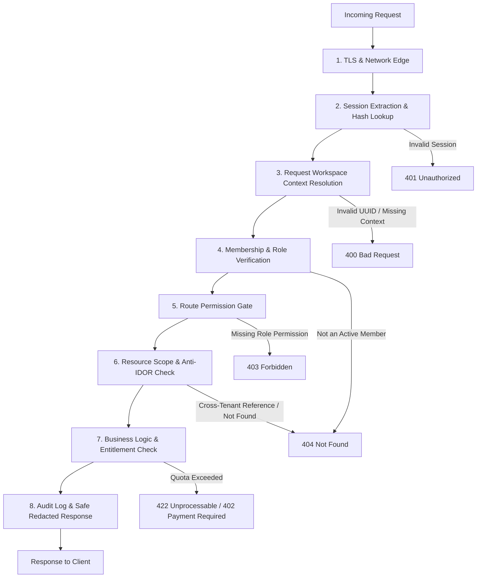
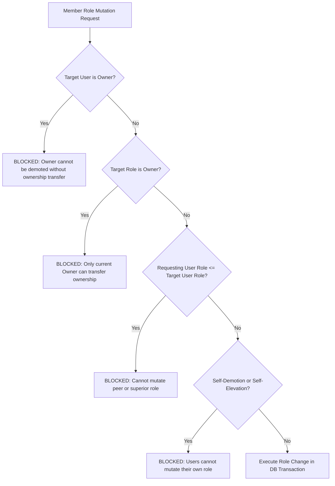
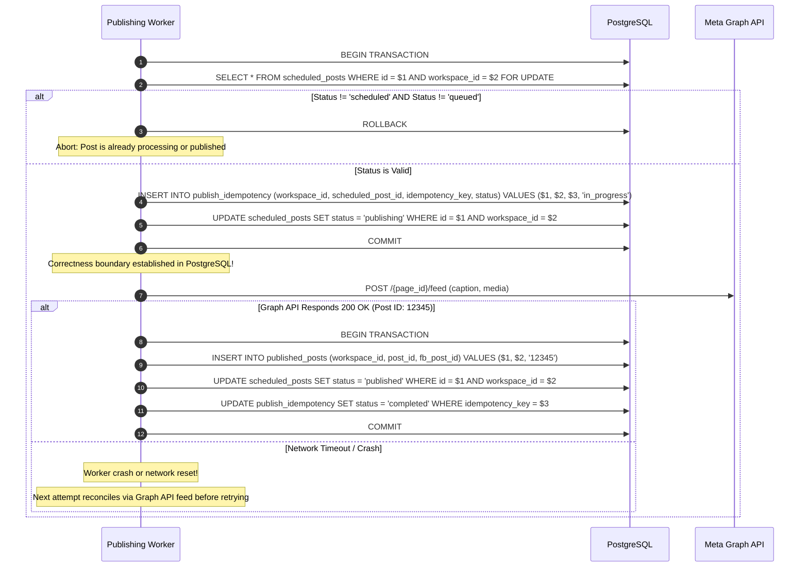

# SaaS Tenant Security, Isolation, and RBAC Model

## 1. Executive Summary

This document specifies the multi-tenant security architecture, authorization pipeline, role-based access control (RBAC) matrix, role-change safety rules, safe logging requirements, and cross-tenant threat models for the Bengali-first Facebook Auto-Poster SaaS.

```
+-----------------------------------------------------------------------------+
|                               Security Status                               |
+--------------------------+--------------------------------------------------+
| CURRENT (Single-Tenant)  | In-memory session Map in middleware/auth.js,    |
|                          | global JSON stores in data/, no workspace scoping|
|                          | unencrypted tokens in settings/env               |
+--------------------------+--------------------------------------------------+
| TARGET (Multi-Tenant)    | PostgreSQL composite tenant keys & RLS, Redis    |
|                          | opaque sessions, 8-step authorization pipeline,  |
|                          | envelope encryption (AES-256-GCM + KMS), safe    |
|                          | publish attempt logging, anti-IDOR checks        |
+--------------------------+--------------------------------------------------+
| DEFERRED                 | Cross-workspace agency shared delegation, SSO    |
+--------------------------+--------------------------------------------------+
```

---

## 2. Eight-Step Request Authorization Pipeline

Every incoming HTTP request targeting tenant-scoped resources must traverse an immutable 8-step security pipeline:



### Pipeline Details

1. **Step 1: TLS Termination & Network Edge**
   - Enforce TLS 1.3, HSTS (`max-age=31536000; includeSubDomains`). Rate limiting per IP and session hash.

2. **Step 2: Session Token Extraction & SHA-256 Lookup**
   - Extract bearer token from `HttpOnly`, `SameSite=Lax`, `Secure` cookie or `Authorization: Bearer` header.
   - Compute $H = \text{SHA-256}(T)$. Query Redis for `session:{H}`.
   - If missing or expired, return `401 Unauthorized`.

3. **Step 3: Request Workspace Context Resolution**
   - The targeted workspace context is extracted from the explicit request URL path (e.g. `/api/v1/workspaces/:workspaceId/...`) or the `X-Workspace-Id` header.
   - Validate that `workspaceId` conforms to UUIDv7 format.
   - **CRITICAL ANTI-TAMPERING RULE**: The server **never** trusts `workspace_id` passed in JSON request bodies as authorization evidence. The server resolves workspace context strictly from the URL path or verified header.

4. **Step 4: Membership & Role Verification**
   - Query PostgreSQL:
     ```sql
     SELECT role, status FROM workspace_members
     WHERE user_id = $1 AND workspace_id = $2;
     ```
   - If row is absent or `status != 'active'`, return `404 Not Found` (anti-enumeration: prevents attackers from confirming whether a workspace exists).

5. **Step 5: Route Permission Gate**
   - Verify that the resolved role (`owner`, `admin`, `editor`, `reviewer`, `viewer`) holds the required permission string (e.g. `approvals:decide`, `posts:publish`).
   - If insufficient role, return `403 Forbidden`.

6. **Step 6: Resource Scope & Anti-IDOR Check**
   - All tenant repository queries MUST include both resource ID and `workspace_id`:
     ```sql
     SELECT * FROM content_posts
     WHERE id = $1 AND workspace_id = $2;
     ```
   - If 0 rows return, respond with `404 Not Found` (never return `403`, which leaks that the resource exists in another tenant).

7. **Step 7: Business Logic & Entitlement Check**
   - Verify plan limits (e.g. active queue capacity, monthly post generation quotas) before executing mutations.

8. **Step 8: Audit Logging & Safe Redacted Response**
   - Mutating actions record structured events in `audit_logs`.
   - Strip all sensitive tokens, internal KMS keys, and secrets before returning JSON to the client.

---

## 3. Role-Based Access Control (RBAC) Matrix

The system establishes 5 canonical roles within a workspace:
- **Owner**: Workspace creator / commercial owner. Full administrative, transfer, and destructive control.
- **Admin**: Operations manager. Manages members, Facebook connections, Page DNA, and settings.
- **Editor**: Content creator. Creates and updates drafts, uploads media, submits posts for approval.
- **Reviewer**: Quality and safety reviewer. Reviews, approves, rejects, and schedules content.
- **Viewer**: Read-only stakeholder or client. Views analytics, drafts, and queue.

### Canonical Permissions Matrix (5 Roles x 13 Domains)

| Resource Domain | Permission String | Viewer | Editor | Reviewer | Admin | Owner |
| :--- | :--- | :---: | :---: | :---: | :---: | :---: |
| **Workspace** | `workspace:read` | Yes | Yes | Yes | Yes | Yes |
| | `workspace:update` | No | No | No | Yes | Yes |
| | `workspace:delete` | No | No | No | No | Yes |
| | `workspace:transfer` | No | No | No | No | Yes |
| **Members** | `members:list` | Yes | Yes | Yes | Yes | Yes |
| | `members:invite` | No | No | No | Yes | Yes |
| | `members:update_role` | No | No | No | Yes | Yes |
| | `members:remove` | No | No | No | Yes | Yes |
| **Billing** | `billing:read` | No | No | No | Yes | Yes |
| | `billing:manage` | No | No | No | No | Yes |
| **Facebook Connections** | `fb_connection:list` | Yes | Yes | Yes | Yes | Yes |
| | `fb_connection:create` | No | No | No | Yes | Yes |
| | `fb_connection:disconnect` | No | No | No | Yes | Yes |
| **Facebook Pages** | `fb_page:read` | Yes | Yes | Yes | Yes | Yes |
| | `fb_page:link` | No | No | No | Yes | Yes |
| | `fb_page:unlink` | No | No | No | Yes | Yes |
| **Page DNA / Profiles** | `page_dna:read` | Yes | Yes | Yes | Yes | Yes |
| | `page_dna:update` | No | No | Yes | Yes | Yes |
| | `page_dna:reset` | No | No | No | Yes | Yes |
| | `page_dna:audit_read` | No | No | No | Yes | Yes |
| **Content Drafts** | `drafts:read` | Yes | Yes | Yes | Yes | Yes |
| | `drafts:create` | No | Yes | Yes | Yes | Yes |
| | `drafts:update` | No | Yes | Yes | Yes | Yes |
| | `drafts:delete` | No | Yes | Yes | Yes | Yes |
| **Post Approvals** | `approvals:read` | Yes | Yes | Yes | Yes | Yes |
| | `approvals:submit` | No | Yes | Yes | Yes | Yes |
| | `approvals:decide` | No | No | Yes | Yes | Yes |
| **Post Scheduling** | `schedule:read` | Yes | Yes | Yes | Yes | Yes |
| | `schedule:create` | No | No | Yes | Yes | Yes |
| | `schedule:update` | No | No | Yes | Yes | Yes |
| | `schedule:cancel` | No | No | Yes | Yes | Yes |
| **Post Publishing** | `publish:manual_trigger`| No | No | Yes | Yes | Yes |
| | `publish:retry` | No | No | No | Yes | Yes |
| **Media Assets** | `media:read` | Yes | Yes | Yes | Yes | Yes |
| | `media:upload` | No | Yes | Yes | Yes | Yes |
| | `media:delete` | No | Yes | Yes | Yes | Yes |
| **Audit Logs** | `audit:read` | No | No | No | Yes | Yes |
| **Webhooks** | `webhooks:read` | No | No | No | Yes | Yes |
| | `webhooks:manage` | No | No | No | Yes | Yes |

---

## 4. Role-Change Safety Matrix

To prevent privilege escalation, accidental lockout, or orphan workspaces, the system enforces the following safety rules:



### Safety Rules Specification
1. **Owner Immutable Demotion**: An `owner` cannot be removed, demoted, or have their role altered without an explicit two-step ownership transfer protocol (`POST /api/v1/workspaces/:id/transfer-ownership`).
2. **Admin Privilege Cap**: An `admin` cannot grant the `owner` role, nor modify the membership of the `owner`.
3. **Anti-Self-Elevation**: A user cannot modify their own role. An `editor` cannot elevate themselves to `reviewer`, `admin`, or `owner`.
4. **Sole Owner Protection**: The final remaining `owner` cannot leave the workspace. The workspace must either be deleted or ownership transferred first.
5. **Instant Invalidation on Removal**: When a member is removed (`status = 'removed'`), any active requests targeting that workspace are immediately rejected with `404 Not Found` (or `403 Forbidden` if workspace context is explicitly stated).

---

## 5. SQL Tenant Query Patterns & Relational Integrity

### Global UUIDs vs Composite Relational Keys
Internal resources use globally unique UUIDv7 identifiers. However, simply using a globally unique `id` does **not** protect against cross-tenant foreign key manipulation if child tables reference only the parent ID.

### Relational Tenant Integrity Pattern
To guarantee that child entities (such as `post_versions` or `scheduled_posts`) cannot accidentally reference a parent entity in a different tenant, the schema enforces **composite foreign keys**:

```sql
-- Parent Table
CREATE TABLE content_posts (
    id UUID PRIMARY KEY,
    workspace_id UUID NOT NULL REFERENCES workspaces(id),
    title VARCHAR(255) NOT NULL,
    created_at TIMESTAMPTZ NOT NULL DEFAULT NOW(),
    CONSTRAINT uq_posts_workspace_id UNIQUE (workspace_id, id)
);

-- Child Table with Composite Foreign Key
CREATE TABLE scheduled_posts (
    id UUID PRIMARY KEY,
    workspace_id UUID NOT NULL REFERENCES workspaces(id),
    post_id UUID NOT NULL,
    scheduled_for TIMESTAMPTZ NOT NULL,
    status VARCHAR(32) NOT NULL,
    created_at TIMESTAMPTZ NOT NULL DEFAULT NOW(),
    CONSTRAINT fk_scheduled_posts_parent
        FOREIGN KEY (workspace_id, post_id)
        REFERENCES content_posts(workspace_id, id)
        ON DELETE CASCADE
);
```
*Why this matters*: Even if an attacker manipulates `post_id` to point to another tenant's post, the database engine **rejects the insert** because the composite pair `(workspace_id, post_id)` does not match.

### Canonical Query Formats
Every tenant query must bind `workspace_id`:
```sql
-- Single resource lookup
SELECT * FROM content_posts
WHERE id = $1 AND workspace_id = $2;

-- Mutating update
UPDATE content_posts
SET title = $3, updated_at = NOW()
WHERE id = $1 AND workspace_id = $2;

-- Tenant-scoped delete
DELETE FROM content_posts
WHERE id = $1 AND workspace_id = $2;
```

---

## 6. Safe Publish Attempt Logging & Structured Redaction

### Threat: Credential Leakage in Telemetry
Attempting to log raw HTTP requests and responses to Facebook Graph API risks writing `PAGE_ACCESS_TOKEN`, user credentials, or sensitive customer data into database tables and log aggregators (e.g. Datadog, CloudWatch).

### Strict Logging Prohibitions
The system **explicitly prohibits** storing or logging:
1. `Authorization` headers or bearer tokens.
2. Facebook User Access Tokens and Page Access Tokens.
3. Client cookies or session tokens.
4. Complete HTTP request headers or raw request bodies.
5. Unredacted Graph API URLs where access tokens are embedded in query parameters (e.g. `?access_token=EAAB...`).
6. Raw exception objects containing memory dumps, stack traces with environment variables, or decrypted secrets.

### Structured `publish_attempts` Table Schema
```sql
CREATE TABLE publish_attempts (
    id UUID PRIMARY KEY,
    workspace_id UUID NOT NULL REFERENCES workspaces(id) ON DELETE CASCADE,
    scheduled_post_id UUID NOT NULL REFERENCES scheduled_posts(id) ON DELETE CASCADE,
    post_version_id UUID NOT NULL REFERENCES post_versions(id) ON DELETE CASCADE,
    attempt_number INT NOT NULL,
    endpoint VARCHAR(128) NOT NULL, -- e.g. "POST /{page_id}/feed" (token redacted)
    http_status INT,                -- e.g. 200, 400, 429
    fb_error_code INT,             -- e.g. 190, 32
    fb_error_subcode INT,          -- e.g. 463
    error_category VARCHAR(64),    -- e.g. "TOKEN_EXPIRED", "RATE_LIMIT", "TIMEOUT"
    duration_ms INT NOT NULL,
    retry_decision VARCHAR(32) NOT NULL, -- "RETRY_SCHEDULED", "MOVED_TO_DLQ", "ABORTED"
    trace_id VARCHAR(64) NOT NULL,
    created_at TIMESTAMPTZ NOT NULL DEFAULT NOW(),
    CONSTRAINT fk_publish_attempts_workspace
        FOREIGN KEY (workspace_id, scheduled_post_id)
        REFERENCES scheduled_posts(workspace_id, id)
);
```

### Pre-Logging Redaction Pipeline
Before writing to `publish_attempts` or console output:
1. Parse URL with standard URL parser. Replace any query parameter named `access_token`, `client_secret`, or `secret` with `[REDACTED]`.
2. Map Graph API error payloads into structured error categories:
   - Error `190` -> `AUTH_TOKEN_EXPIRED`
   - Error `4` / `17` / `32` / `613` -> `RATE_LIMIT_EXCEEDED`
   - Network timeout -> `NETWORK_TIMEOUT`
3. Discard raw error objects after extracting `code`, `subcode`, and sanitized `message`.

---

## 7. Database Idempotency as Correctness Boundary

Redis distributed locks (Redlock) are an optimization to prevent concurrent queue contention. However, **PostgreSQL is the definitive correctness boundary** for preventing duplicate publishing.

### Transactional Publishing Protocol


### Crash Reconciliation Procedure
If a worker terminates unexpectedly between Step 6 (Commit `publishing`) and Step 8 (Facebook call outcome):
1. A reconciliation monitor identifies posts stuck in `status = 'publishing'` for more than 5 minutes.
2. The monitor inspects the Facebook Page feed (`GET /{page_id}/feed?limit=5`) matching caption and approximate timestamp.
3. If the post exists on Facebook, the monitor inserts `published_posts` and marks the post `published`.
4. If the post does not exist on Facebook, the monitor resets `scheduled_posts.status = 'queued'` to permit a safe retry.

---

## 8. Comprehensive Cross-Tenant Threat Model (15 Scenarios)

The following matrix documents the 15 required cross-tenant threat scenarios, their attack mechanisms, preventative architecture, database constraints, middleware controls, and automated verification tests.

### Threat 1: IDOR Through Page ID
- **Attack**: Tenant B guesses Tenant A's internal `facebook_pages.id` and attempts `GET /api/v1/workspaces/ws-B/pages/:pageId`.
- **Prevention**: Enforce composite tenant scoping on every page lookup.
- **Database Constraint**: `UNIQUE (workspace_id, id)` and unique constraint on `facebook_page_id`.
- **Middleware / Query Control**:
  ```sql
  SELECT * FROM facebook_pages
  WHERE id = $1 AND workspace_id = $2;
  ```
  Return `404 Not Found` if 0 rows returned.
- **Automated Test**: `test_idor_page_lookup_other_tenant_returns_404()`.

### Threat 2: IDOR Through Post or Draft ID
- **Attack**: Tenant B sends `PATCH /api/v1/workspaces/ws-B/posts/:postId` with a payload to alter Tenant A's post.
- **Prevention**: All content tables enforce `workspace_id`.
- **Database Constraint**: Composite foreign key `FOREIGN KEY (workspace_id, post_id) REFERENCES content_posts(workspace_id, id)`.
- **Middleware / Query Control**: Repository query enforces `WHERE id = $1 AND workspace_id = $2`.
- **Automated Test**: `test_cross_tenant_post_update_returns_404()`.

### Threat 3: Workspace ID Body Tampering
- **Attack**: Tenant B is authorized in Workspace B, but sends `POST /api/v1/workspaces/ws-B/posts` with `\"workspace_id\": \"<workspace-A-uuid>\"` in the JSON body.
- **Prevention**: Request payload schema validator strips or rejects `workspace_id` in request bodies. The repository uses only the verified URL/header workspace context.
- **Database Constraint**: Foreign key references enforce parent workspace integrity.
- **Middleware / Query Control**: Body sanitizer discards client-supplied `workspace_id`.
- **Automated Test**: `test_ignore_body_workspace_id_tamper()`.

### Threat 4: Changing Active Workspace Without Membership
- **Attack**: User belongs to Workspace A. User sends `GET /api/v1/workspaces/ws-B/posts` with Header `X-Workspace-Id: ws-B`.
- **Prevention**: Step 4 of authorization pipeline queries `workspace_members` for `(user_id, ws-B, status='active')`.
- **Database Constraint**: `PRIMARY KEY (workspace_id, user_id)` in `workspace_members`.
- **Middleware / Query Control**: Missing membership row results in `404 Not Found`.
- **Automated Test**: `test_cannot_access_unjoined_workspace_returns_404()`.

### Threat 5: Cached Data From a Previous Workspace
- **Attack**: User opens Workspace A and Workspace B in separate tabs. Client cache returns Workspace A's Page DNA in Workspace B's view.
- **Prevention**: Client cache keys and server-side Redis caches are namespaced strictly: `ws:${workspace_id}:...`.
- **Database Constraint**: N/A (Cache layer policy).
- **Middleware / Query Control**: HTTP responses include `Cache-Control: no-store, private`.
- **Automated Test**: `test_workspace_cache_isolation_across_tabs()`.

### Threat 6: Webhook Event Assigned to Wrong Tenant
- **Attack**: Meta posts webhook for a Facebook Page. An attacker spoofs payload or lookup assigns event to wrong tenant.
- **Prevention**:
  1. Verify `X-Hub-Signature-256` HMAC with App Secret.
  2. Map `entry[].id` (Facebook Page ID) against `facebook_pages` table where `status = 'active'`.
  3. Strict 1:1 ownership guarantees exactly one workspace is resolved.
- **Database Constraint**: `UNIQUE (facebook_page_id)` where `status != 'disconnected'`.
- **Middleware / Query Control**: Webhook ingest verifies HMAC signature before payload parsing; tenant resolver drops unmapped pages.
- **Automated Test**: `test_webhook_tenant_resolution_with_strict_page_mapping()`.

### Threat 7: Background Job Dispatched With Wrong Workspace
- **Attack**: A delayed publishing job in BullMQ contains a mismatched payload, publishing Tenant A's post to Tenant B's Facebook page.
- **Prevention**: Job payload carries `workspaceId`, `facebookPageId`, `scheduledPostId`. The worker verifies in a PostgreSQL transaction that all three entities share the exact same `workspace_id`.
- **Database Constraint**: Composite foreign keys `(workspace_id, id)`.
- **Worker Control**:
  ```javascript
  if (post.workspace_id !== job.workspaceId || page.workspace_id !== job.workspaceId) {
    throw new SecurityIntegrityError('Cross-tenant job mismatch detected');
  }
  ```
- **Automated Test**: `test_worker_rejects_cross_tenant_job_payload()`.

### Threat 8: Media Asset URL Leakage
- **Attack**: Tenant B discovers or guesses public cloud storage URL for an image uploaded by Tenant A.
- **Prevention**: S3 buckets are private. Access requires 15-minute pre-signed URLs generated only after verifying that the requester is an active member of the owning workspace.
- **Database Constraint**: `media_assets` table has `workspace_id NOT NULL`.
- **Middleware / Query Control**: `GET /api/v1/workspaces/:wsId/media/:id/url` validates workspace membership.
- **Automated Test**: `test_tenant_cannot_request_presigned_url_for_foreign_media()`.

### Threat 9: Audit-Log Leakage
- **Attack**: Tenant B queries audit logs and observes admin activity belonging to Tenant A.
- **Prevention**: `audit_logs` has mandatory `workspace_id`.
- **Database Constraint**: `FOREIGN KEY (workspace_id) REFERENCES workspaces(id)`.
- **Middleware / Query Control**: `SELECT * FROM audit_logs WHERE workspace_id = $1 ORDER BY created_at DESC`.
- **Automated Test**: `test_audit_log_query_isolated_to_request_workspace()`.

### Threat 10: Search / Filter Leakage
- **Attack**: Full-text search returns content from other workspaces.
- **Prevention**: Search queries enforce `workspace_id = $1` as the root predicate.
- **Database Constraint**: Composite GIN index on `(workspace_id, search_vector)`.
- **Middleware / Query Control**: Query builder mandates `workspace_id = $1`.
- **Automated Test**: `test_search_never_returns_cross_tenant_records()`.

### Threat 11: Usage / Billing Leakage
- **Attack**: Tenant B accesses subscription endpoints and views Tenant A's billing details or GSTIN.
- **Prevention**: Subscriptions and usage tables are keyed to `workspace_id`. Access requires `billing:read` permission.
- **Database Constraint**: `UNIQUE (workspace_id)` on `subscriptions`.
- **Middleware / Query Control**: Role check restricts billing access to `owner` and `admin`.
- **Automated Test**: `test_billing_endpoints_isolated_to_authorized_roles()`.

### Threat 12: Error-Message Enumeration
- **Attack**: Attacker differentiates between missing resources (`404`) and existing resources in other workspaces (`403`).
- **Prevention**: Uniform response: Any resource not found or belonging to another workspace ALWAYS returns `404 Not Found` with generic message `Resource not found`.
- **Database Constraint**: N/A.
- **Middleware / Query Control**: Error handling layer masks authorization mismatch as standard 404.
- **Automated Test**: `test_cross_tenant_resource_returns_identical_404()`.

### Threat 13: Invited User Escalating Role
- **Attack**: An Editor user submits a request to elevate their role to `admin`.
- **Prevention**: Section 4 Role-Change Safety Matrix enforces that users cannot elevate their own role, and non-admins cannot invoke `members:update_role`.
- **Database Constraint**: Database trigger checks caller role hierarchy.
- **Middleware / Query Control**: Endpoint validates caller role > target role.
- **Automated Test**: `test_editor_cannot_escalate_own_role_to_admin()`.

### Threat 14: Removed Member Retaining an Active Session
- **Attack**: User is removed from Workspace A, but sends requests using an existing session token.
- **Prevention**: Step 4 checks `workspace_members` on every request. Status `removed` causes immediate `404 Not Found`.
- **Database Constraint**: `status = 'removed'` in `workspace_members`.
- **Middleware / Query Control**: Authorization middleware rejects removed members without waiting for session expiry.
- **Automated Test**: `test_removed_member_immediately_loses_workspace_access()`.

### Threat 15: Shared Browser Multi-Tab Context Conflict
- **Attack**: User switches workspace in Tab 1; an action in Tab 2 accidentally executes against Tab 1's new workspace.
- **Prevention**: Workspace context is bound to URL path or request header, NOT to a mutable global session variable. Each tab operates independently.
- **Database Constraint**: N/A.
- **Middleware / Query Control**: Request validates membership for the specific `workspace_id` in the request URL.
- **Automated Test**: `test_multi_tab_concurrent_workspace_requests_do_not_interfere()`.
